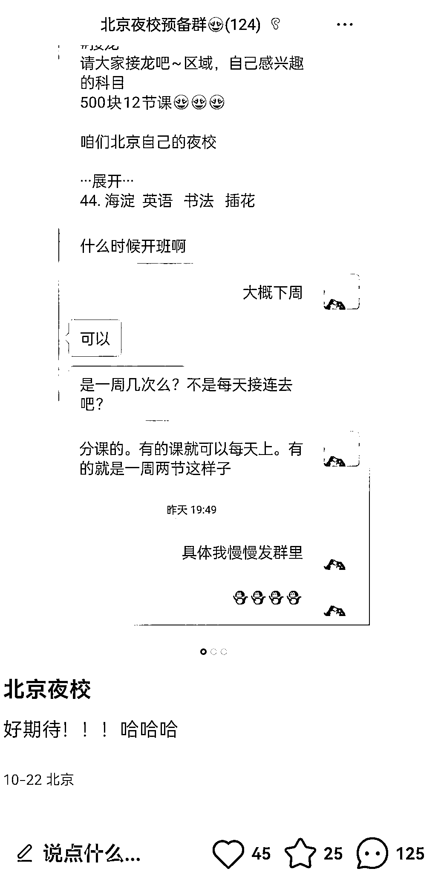
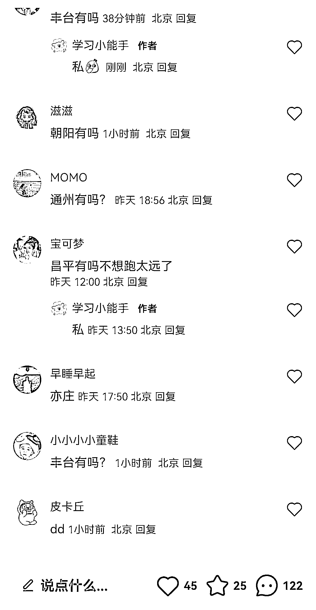
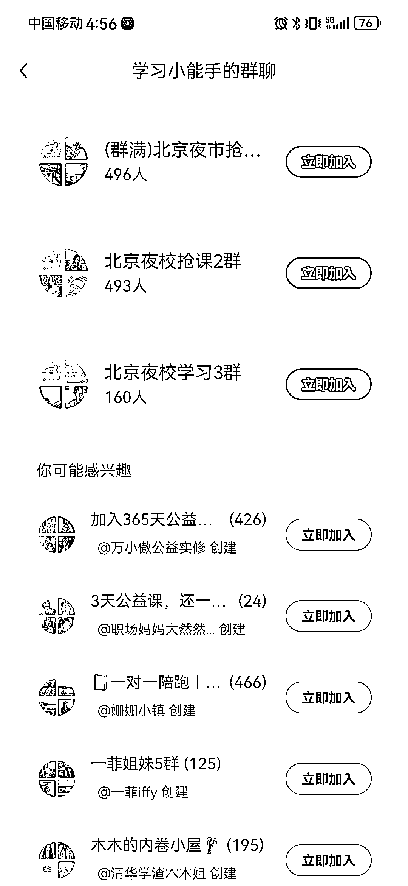

# 夜校热潮席卷年轻人，一线城市也可复制这个玩法

> 原文：[`www.yuque.com/for_lazy/xkrm14/dwm60gbmx9e0efv8`](https://www.yuque.com/for_lazy/xkrm14/dwm60gbmx9e0efv8)

作者： hedy

日期：2023-10-24

点赞数：**81**

* * *

正文：

你今晚去夜校不？
最近年轻人热衷于上夜校，在小红书刷到一篇有关北京夜校的笔记，有很多科目，12 节课 500 元，下面好多人都在问各个地区是否有夜校，需求很大~看了下博主建的群，人数已经 1100+了
其他一线城市也可复制这个玩法，这些用户沉淀到私域后，因为都是精准的同城用户，而且都是愿意付费投资自己的群体，变现价值非常高~

* * *

评论区：

Eason : 深圳只有夜宵

胖大魔 : 混进五群了[奸笑]

Luna·呼呼 : 巧了，群 7[憨笑]

胖大魔 : 微信吗？五群 176，七群多少人[奸笑]

Luna·呼呼 : 133 人，还以为前面的群满了呢

谢不言｜小红书电商 : 这个生意的复购点在什么？机构的渠道费吗？

* * *

