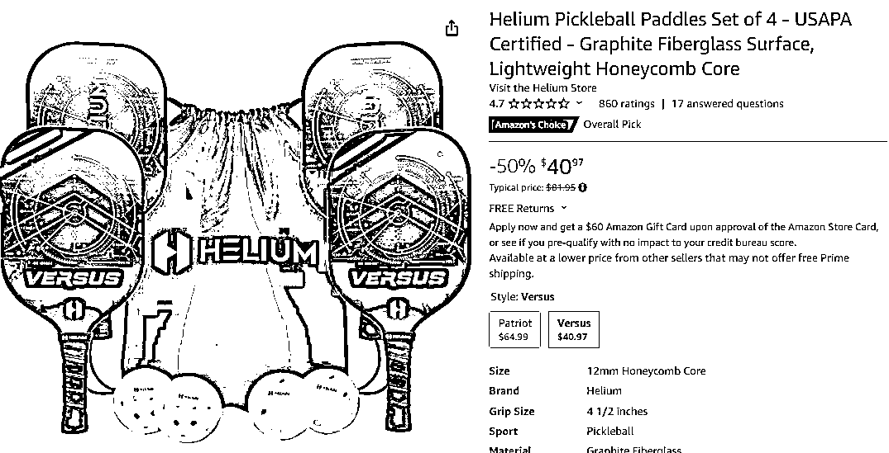
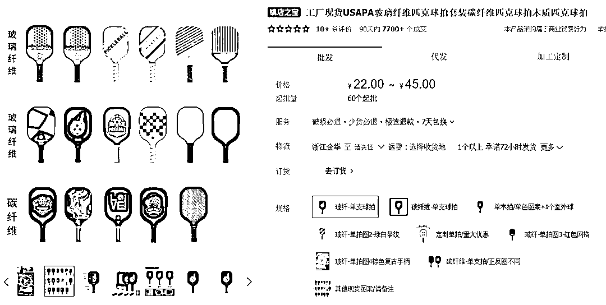

# TikTok 上的匹克球成为热门，标签播放破十亿

> 原文：[`www.yuque.com/for_lazy/xkrm14/gzx8vnaabx7hvo0g`](https://www.yuque.com/for_lazy/xkrm14/gzx8vnaabx7hvo0g)

作者： Max

日期：2023-10-18

点赞数：**71**

* * *

正文：

TikTok“匹克球”获千万播放持续火爆，标签播放破十亿
目前已经超过 3600 万美国人在玩匹克球。在 2021 年之前仅有 500 万用户，相较于 2021 年增长了 3000 万，是近几年来发展最快的户外运动，其中一个原因是 Z 世代的加入形成了传播，在 TikTok 等社交媒体上，有大量用户在分享这项运动以及相关内容。凭借其特点“运动强度低，新手易学，场地不受限”大获好评，在 TikTok 搜索相关词条#pickleball 获得 10 亿播放。
通过 Google Trends 我们可以了解到一定时期内，产品关键词在搜索引擎上的搜索热度和市场趋势。
从下方搜索趋势不难看出全球地区关于“pickleball”的搜索热度在过去搜索热度平稳，在 2023 年的 7.9-7.15 达到峰值 100，随后缓慢下降至 75 左右，除此之外，在 7.30-8.5 左右，best
pickleball paddles 2023（2023 年最佳匹克球拍）达到峰值 100，全年都有一定的搜索热度。
亚马逊售价 40 美刀的球拍在 1688 搜索到相似产品单支球拍价格为 22 元（仅供参考）
总结：除了 3600 万已经在长期练习匹克球的人口外，还有大量正在接触或者张望的潜在用户，通过数据来看，匹克球在 2023 年属于火爆项目，越来越多的用户参与到这项运动中。在未来有一定的前景，有合适货源的卖家可以选择相关产品进行尝试。

* * *

评论区：

* * *

