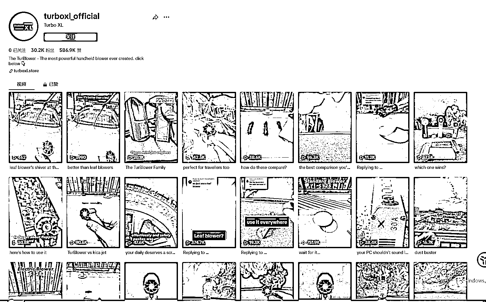
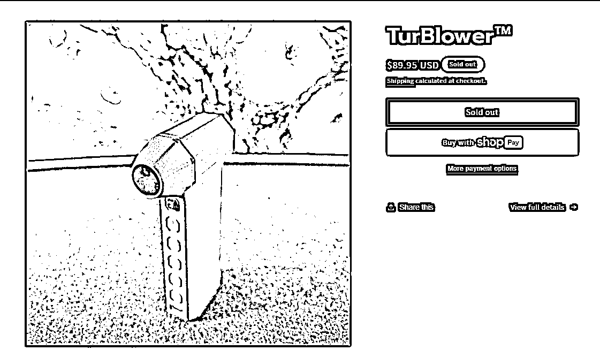

# TikTok 上的迷你旋涡风扇成为热门单品，展示量超过 8.18 亿次

> 原文：[`www.yuque.com/for_lazy/xkrm14/rtaob8h5ale3gf17`](https://www.yuque.com/for_lazy/xkrm14/rtaob8h5ale3gf17)

作者： Max

日期：2023-10-20

点赞数：**52**

* * *

正文：

TikTok 上三个月自然流过亿曝光的单品：迷你旋涡风扇。单#jetfan 一个标签目前为止已有 8180 万展示量
打开开关，随着强劲的风力一吹，烧烤炉内煤炭在极短时间内被点燃，短短七秒的视频收获上千万播放和二十几万赞。这款“小身材大能量”的迷你涡轮风扇在 TikTok
上成了万千观众感兴趣的产品，评论区有很多人评论在哪可以买到这个产品。 @turboxl_official 这个账号于今年 8 月 25
日发布首条视频，不到两个月的时间积累了近 3 万粉丝和近 60
万的点赞。个人简介也很简明扼要，用两句话既强调了自家产品的卖点和地位，作者将已经验证过的爆款框架反复利用，吹汽车吹树叶吹沙等不同场景切换，视频内容简单扼要，卖点阐述清晰。
目前点击该账号主页链接查看，该产品已暂时售罄。独立站内售价 89 美刀，对于国内制造业来讲有挺大的利润空间，有相关供应链资源的朋友或者正在选品出海的朋友可以尝试。

* * *

评论区：

良辰-Oswald😉 : 海外 tiktok 分地区吗？还是说根据 IP 来定区域

无所从来 : 拿货价格不低

Max : 按国家分地区的，每个国家的电商业务目前都是独立分开的

* * *

公众号懒人找资源，懒人专属群分享