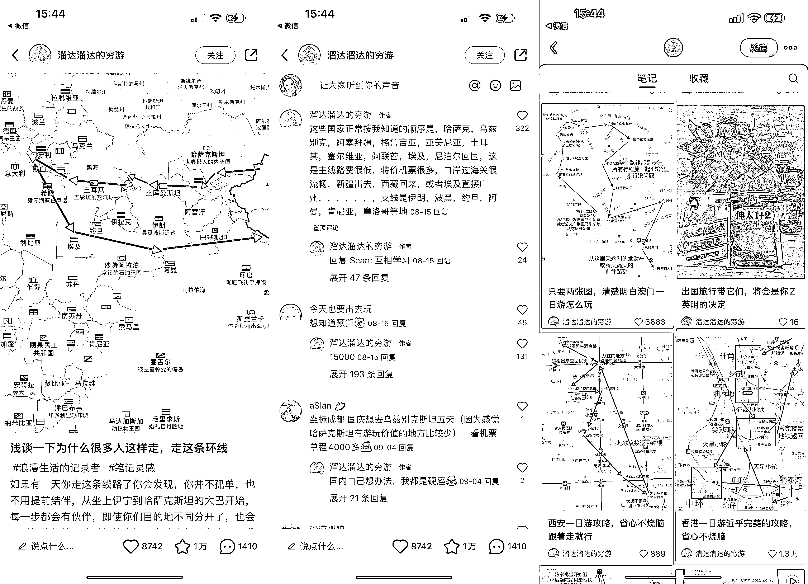

# 可复制的小红书玩法：地图路线截图+旅游社景区、酒店民宿等，种草攻略

> 原文：[`www.yuque.com/for_lazy/xkrm14/uz4s3d5utvy4ecvz`](https://www.yuque.com/for_lazy/xkrm14/uz4s3d5utvy4ecvz)

作者： 蔡文静好文静

日期：2023-10-08

点赞数：**107**

* * *

正文：

可复制的小红书玩法：地图路线截图+旅游社景区、酒店民宿等，种草攻略 该旅行博主账号 1.4 万粉丝，不断复用这类型爆款形式，重复出多条爆款数据 内容玩法：
1、封面图：简单截图地图 APP，再加上重点标题花字、箭头即可，一页纸让人感觉信息满满 2、原博主也不断在复用这类爆款形式，也不停在再产生爆款
3、做景区酒店民宿等旅游服务行业，除了多发一些产品服务介绍，更可以发这一类简单的旅游线路攻略，更易出爆款，拉升账号权重和数据
4、标题关键词：xx 城市、一日游、攻略、一张图、跟着走 引流钩子： 1、评论区有用户说：想进群 变现方式： 1、接商业广告为主（旅游相关、出游产品好物等）
2、未来可以引流私域，做旅游线路定制及旅游周边产品服务提供

* * *

评论区：

谬误剑士 : 与境外旅行社合作，拿佣金，可以这样引流

* * *

公众号懒人找资源，懒人专属群分享