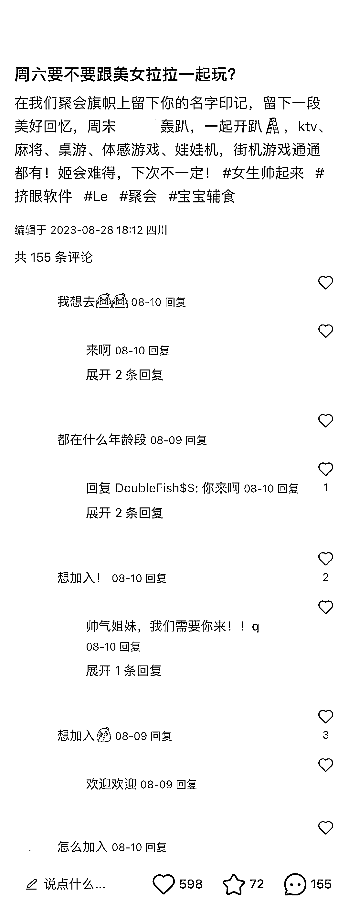

# 小红书引流女同社群，打造彩虹交友圈，低成本体验引导成交

> 原文：[`www.yuque.com/for_lazy/xkrm14/ys86txwafwlx0vo5`](https://www.yuque.com/for_lazy/xkrm14/ys86txwafwlx0vo5)

作者： 郑 sir

日期：2023-10-10

点赞数：**64**

* * *

正文：

小红书，引流做女同社群的
笔记发聚会照片（很注重隐私，照片都深码）、活动预告、同性伴情感科普等内容，加#通讯录#彩虹男孩/女孩等圈内人懂的都懂的标签，引导意向客户评论区咨询，引流微信成交。
提供交友、脱单服务，每次收费 98-2580 元，有以下 3 类活动：线下聚会（约饭、专场派对、专题讲座）；户外活动（露营、短途旅游、农家乐）；线上交流群（参加过活动的可免费进）。
通过社群的方式，让用户低成本体验，建立信任后，后端追销其它产品，例如：同性伴侣法律咨询、旅游公司、接同城广告（同志酒吧、健身房）等。

* * *

评论区：

朱朱侠 : 前段时间那个猫和老鼠的线下真人游戏，是不是也可以针对拉拉人群，吸引本地流量。另外，针对每一个人群分类，是不是都可以制作有针对性的线下活动来引流？

郑 sir : 感谢亦仁大大

竹芯 : 有对标帐号吗

* * *

公众号懒人找资源，懒人专属群分享