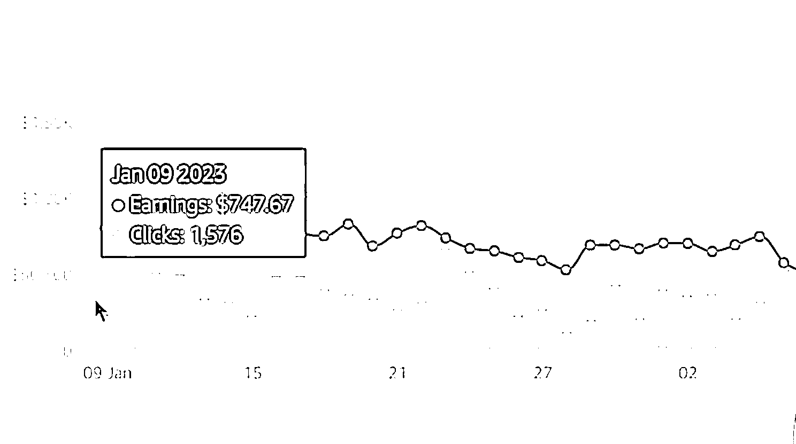

# 亚马逊 influencer 项目：发布视频赚钱，蓝海市场的机会

> 原文：[`www.yuque.com/for_lazy/xkrm14/ufdhd5qnqzq7yt3c`](https://www.yuque.com/for_lazy/xkrm14/ufdhd5qnqzq7yt3c)

作者： Wheels

日期：2023-09-26

点赞数：**85**

* * *

正文：

亚马逊 influencer 项目，22 年末亚马逊官方推出的，目前属于蓝海，帮热销品配视频，家里有的东西，能够在亚马逊找到的就可以拍，发布上去有人看就可以赚钱，150 多个视频，一个月 6000 多刀

* * *

评论区：

郭小帅 : 我看官方介绍，这个是要点击你的链接卖掉才有佣金是吗？

陪你去看海 : cps 结算，类似达人带货。

郭小帅 : 明白了

华子树 : 可以链接交流下吗？

* * *

公众号懒人找资源，懒人专属群分享