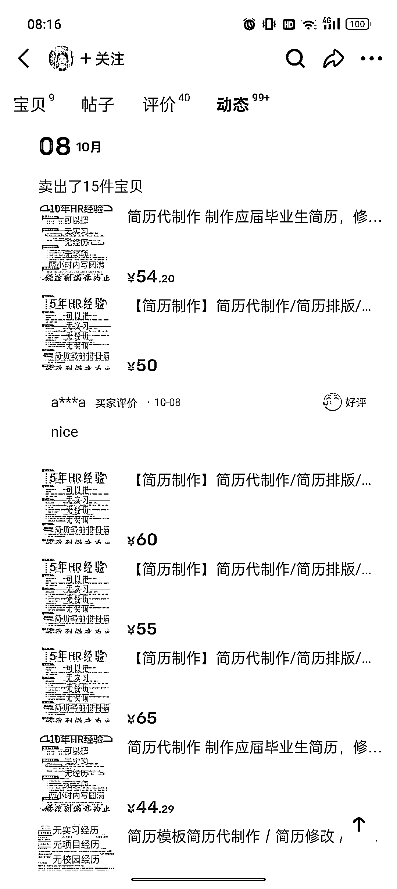
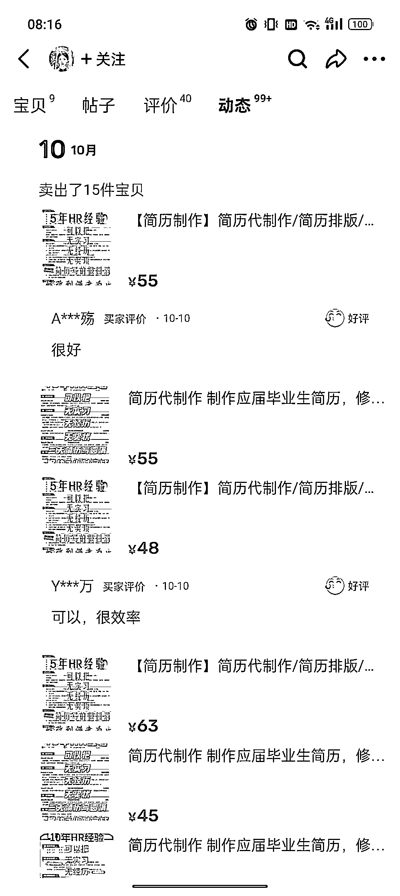

# AI 简历修改，低成本高利润，每天平均卖出 15 份以上

> 原文：[`www.yuque.com/for_lazy/xkrm14/hyqquvf5giekfdcz`](https://www.yuque.com/for_lazy/xkrm14/hyqquvf5giekfdcz)

作者： 饭饭

日期：2023-10-11

点赞数：**73**

* * *

正文：

闲鱼简历修改爆品 单价 55，单账号平均每天卖出 15 以上， 巧用 AI 进行简历修改，做到低成本高利润。 现在是简历投递的旺季，接下来会更火。

* * *

评论区：

夏林 : Ai 还真不行，这个单价几乎都是人工修改，而且还需要和客户电话沟通

饭饭 : [憨笑]可以多熟悉一下 AI 使用

CZH : Ai🉑根据客户提供的现有信息，针对岗位进行内容优化，但不确定一次能不能搞的定

* * *

公众号懒人找资源，懒人专属群分享