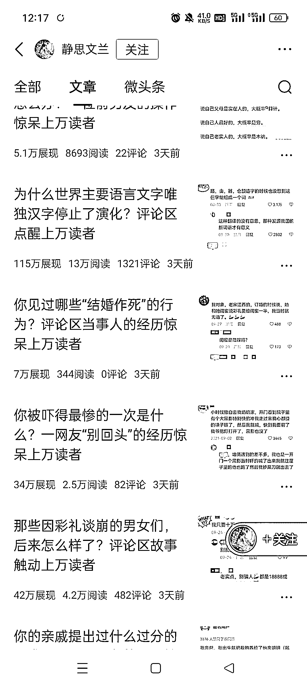

# 今日头条搬运小红书评论区截图，浏览量飙升

> 原文：[`www.yuque.com/for_lazy/xkrm14/dqbvv9kkudkzhhq1`](https://www.yuque.com/for_lazy/xkrm14/dqbvv9kkudkzhhq1)

作者： 晓蓉

日期：2023-10-09

点赞数：**159**

* * *

正文：

今日头条搬运小红书的评论区截图，浏览量都挺高的

* * *

评论区：

刘继春 : 那是不是也能迁移到公众号上？！！

liliya : 视频号也行吧[偷笑]

刘继春 : 哈哈哈，都行！一鱼多吃！

晓蓉 : 可以的

孟里啥都有 : 试过两个号，但没啥结果

空格 : 收益怎么样

* * *

公众号懒人找资源，懒人专属群分享