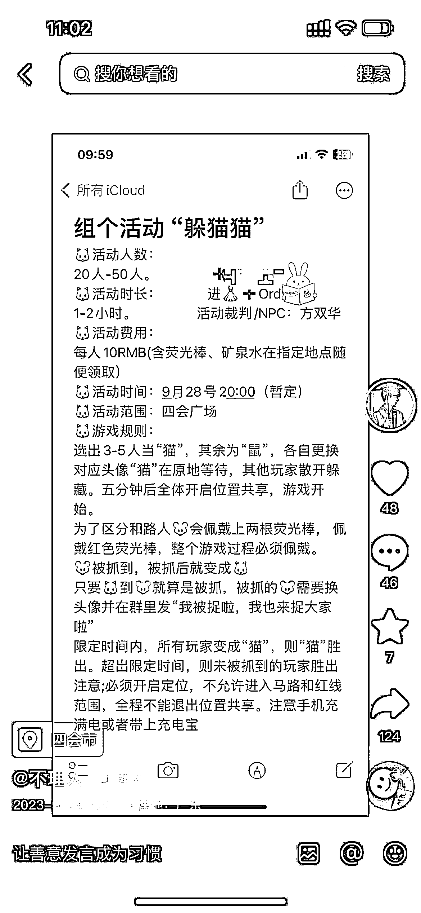

# 发现三线小城市的线上流量机会：猫捉老鼠活动引爆社群

> 原文：[`www.yuque.com/for_lazy/xkrm14/gbby2858ncn97o52`](https://www.yuque.com/for_lazy/xkrm14/gbby2858ncn97o52)

作者： 小然同学

日期：2023-09-28

点赞数：**97**

* * *

正文：

发现一个三线小城市的线上流量机会： 1\. 选择新鲜好玩噱头足的活动（比如“猫捉老鼠），抖音发布图文版同城活动规则
2.规则里暗戳戳地留下添加方式（比如“进👗➕xxx） 3.关闭好友验证，让潜在用户秒加你 4.直接邀请进群
现在这个群接近 400 人+，水了两天发现年龄偏小，估计有本地初高中学生、年轻打工人、新到当地的打工人等。
这个群和形式，完全可以作为面向小城年轻人群体的实体店线上流量渠道之一。 但灌水内容比较多，大部分人可能跟我一样潜水哈哈。

* * *

评论区：

海波  活动策划师 : 好玩

小然同学 : 群里都是好评，现在快 500 人大群了

艾小飞 : 我一个月前拆解过这个项目

程序员八两 : 这里面的流量还能用来引流给红娘业务

小然同学 : 哇，第一次写就中标！感谢亦仁！

小然同学 : 赞！

小然同学 : 又是一个新思路！

* * *

公众号懒人找资源，懒人专属群分享