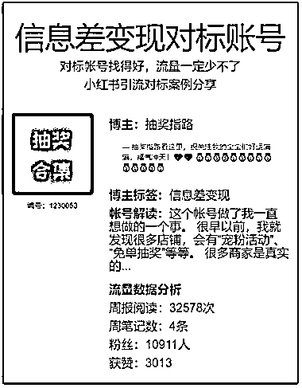

# 揭秘宠粉活动，一键直达举办活动的博主

> 原文：[`www.yuque.com/for_lazy/xkrm14/oon77xqbid3geug7`](https://www.yuque.com/for_lazy/xkrm14/oon77xqbid3geug7)

作者： 深圳老刘

日期：2023-09-27

点赞数：**81**

* * *

正文：

这个帐号做了我一直想做的一个事。 很早以前，我就发现很多店铺，会有“宠粉活动”、“免单抽奖”等等。
很多商家是真实的举办活动的，只要简单的参与他们的笔记留言评论，就有比较高的机会中奖。 反正闲着也是闲着，所以就会有很多人关注留言，领取礼物。
那么我们可以收集，说得不好听一点，就是搬砖式的搜索再整理一下，就是一篇干货满满的笔记了。 笔记内容直接链接上举办活动的博主，可以一键直达。
那么提供这种信息集合本身就成了我们自己这个帐号的价值所在。

* * *

评论区：

小猪扑满 : 那这个方式怎么变现呢？

深圳老刘 : 涨粉后接广告 卖号 换内容都行

倪大胖 : 如何采集呢

田新一 : 第二张图是什么账号呀

深圳老刘 : 第二张图是我收集的案例展现格式，多一些数据分析，跟第一张是同一个帐号。

田新一 : 展现的形式挺好的[呲牙]

* * *

公众号懒人找资源，懒人专属群分享