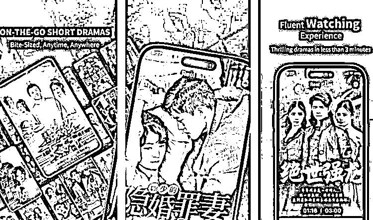

# 美国吸金、东南亚狂飙，短剧生长迎来红利时代

> 原文：[`www.yuque.com/for_lazy/xkrm14/xbmmul244hfaia8c`](https://www.yuque.com/for_lazy/xkrm14/xbmmul244hfaia8c)

作者： 静水流深

日期：2023-09-26

点赞数：**73**

* * *

正文：

美国吸金、东南亚狂飙 短剧生长迎来红利时代？ Sensor
Tower 统计数据显示，ReelShort 从 7 月上旬开始收入猛增，日流水实现飞升，最高达到单日 30 万美元以上收入。
根据广大大数据显示，7 月 ReelShort 双端内购收入超过 500 万美元，以单部剧 80 集、单集剧 0.25 美元价格来看，相当于 25 万个用户在 ReelShort 平台上完整观看一部短剧。
这还没有算上广告变现收入的部分，在 ReelShort 的评论区，狂热追剧的粉丝基本会看满其应用给出的“每天 20 次”广告，不愿意错过一个免费解锁的机会。
[`tj51bxige8.feishu.cn/docx/GVUodHXBUoETMxxT...`](https://tj51bxige8.feishu.cn/docx/GVUodHXBUoETMxxTfTrc88S4nOc) 

* * *

评论区：

程序员八两 : 国外好像没短剧 cps 平台，是不是值得去做一个？

亦仁 : 啸哥海外短剧第一

* * *

公众号懒人找资源，懒人专属群分享