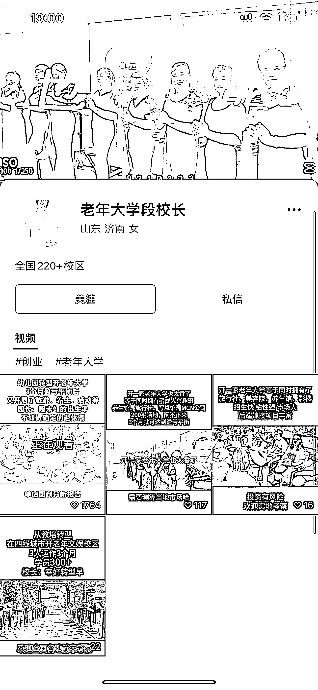
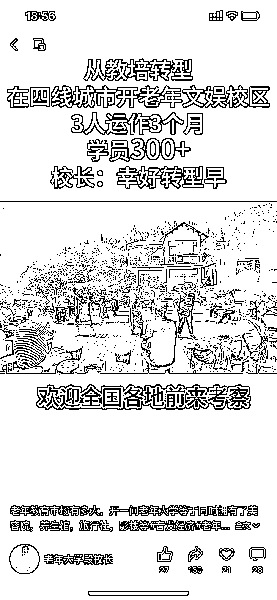

# 中老年市场转型：幼儿园变身老年大学，引流私域做加盟

> 原文：[`www.yuque.com/for_lazy/xkrm14/snxhywwoicfki0li`](https://www.yuque.com/for_lazy/xkrm14/snxhywwoicfki0li)

作者： 瓶子

日期：2023-10-11

点赞数：**75**

* * *

正文：

中老年市场太庞大，幼儿园转型做老年大学，视频播放量和评论都不小，引流私域做加盟。

* * *

评论区：

花天卓 : 这个厉害

瓶子 : 未来就是送完爸妈去幼儿园再去上班了，哈哈哈

瓶子 : 哇哇，谢谢亦仁大大，激动的心颤抖的手，我要干了这杯酒，再接再厉[拳头]

. : 等我老了，也想去这种大学[偷笑]

艾小飞 : 反向操作，思路不错

HDDD : 感觉就是老年活动中心 哈哈哈

may : 老人家市场闹哄哄啊！

* * *

公众号懒人找资源，懒人专属群分享