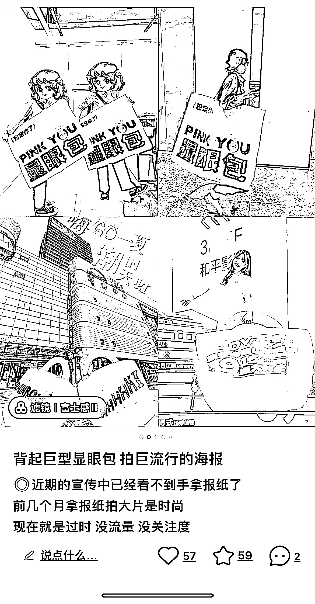
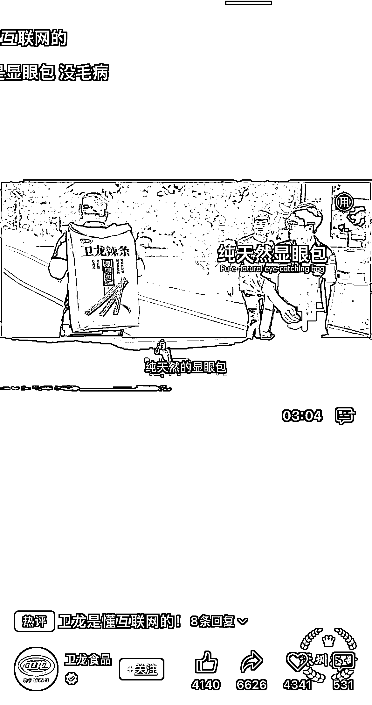

# 显眼包营销：非常吸引眼球的反常规策略

> 原文：[`www.yuque.com/for_lazy/xkrm14/qohkkg9betk8m22d`](https://www.yuque.com/for_lazy/xkrm14/qohkkg9betk8m22d)

作者： 深圳志哥

日期：2023-09-26

点赞数：**52**

* * *

正文：

显眼包营销 反常规营销，包包规格一般小。你设计的大，是巨大包，产生视觉，这是非常吸引眼球，风向标航海中说的异常值，非常好广告创新。
1.卫龙辣条，把握流量密码，显眼包发布会。 2.各大商超艺术展广告，显眼包显示，视觉冲击。
建议做品牌 ip 的，可以 1688 某宝定制巨大容量包，印上 Logo 或营销二维码。找 30 个兼职临时人员，线下背上定制巨大显眼包，在人流商超景点闲逛，拍照打卡，网络造势推广，低成本营销引流！

* * *

评论区：

深圳志哥 : 谢谢老大~继续打卡发风向标，冲冲冲！！！[愉快]

* * *

公众号懒人找资源，懒人专属群分享