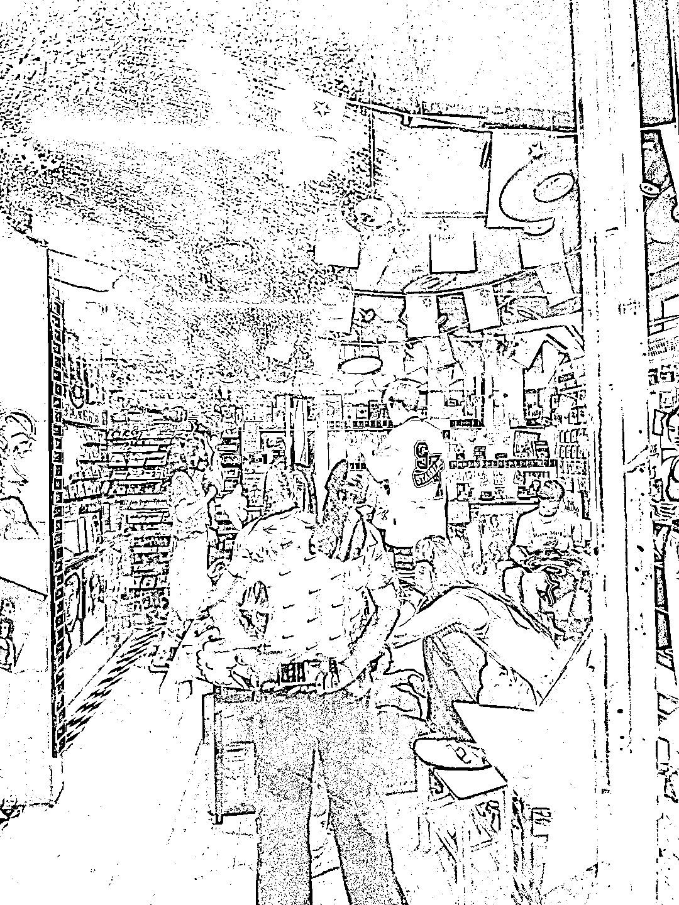
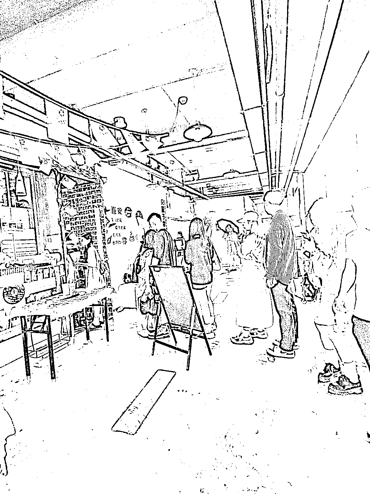

# 厦门沙尾巷旅游发现的玩法，适合旅游文艺区的实体店

> 原文：[`www.yuque.com/for_lazy/xkrm14/khy1gw0k0lo7p3y4`](https://www.yuque.com/for_lazy/xkrm14/khy1gw0k0lo7p3y4)

作者： better me

日期：2023-10-09

点赞数：**48**

* * *

正文：

在厦门沙尾巷旅游的时候发现的玩法，很适合旅游文艺区的实体店。比如重庆的贰厂 1.店外设置一个打卡区 2.摆放一些时候拍照的道具 3.设置打卡姿势推荐案例
4.室内帮拍指导+费用+既得拍立得照片 整个流程非常顺 这个店下午 2 点外面要热死的时候去，都还有人在排队想进去拍照，效果很好

* * *

评论区：

better me : 💪💪💪💪

* * *

公众号懒人找资源，懒人专属群分享