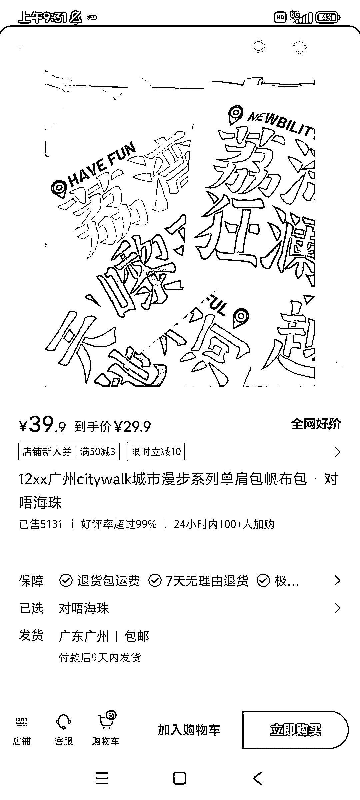
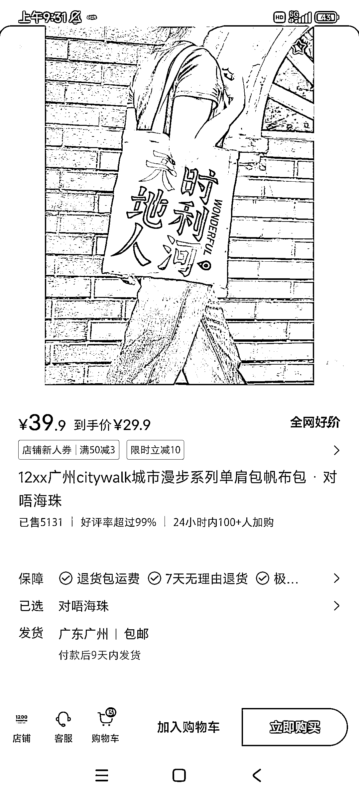

# 小红书上的 12xx 书店帆布包，因传播属性爆单，店内还有其他文创品。

> 原文：[`www.yuque.com/for_lazy/xkrm14/grssidu9gkog48ag`](https://www.yuque.com/for_lazy/xkrm14/grssidu9gkog48ag)

作者： 阿黎

日期：2023-10-16

点赞数：**125**

* * *

正文：

文创品类，加入地域、群体标签等具有传播属性的元素，容易爆单，因为更容易获得转发和认同。小红书上这款 12xx 书店的帆布包，很好卖，关键，店里还有其他文创品。

* * *

评论区：

艾小飞 : 刚去小红书看了，很独特，只有他一家在做，去拼多多想看进货渠道，居然没有，那就更厉害了[强]

墨北 : 估计是自己找的供货商定制？

威曹 : 回复艾小飞：他们确实是自己定制的，还有其他一些文创品。1200bookshop，这个品牌在广州有好几家线下书店，销量应该也有 IP 加持

Bruce : 有文创定制资源的朋友吗，我出设计发笔记带货

阿黎 : 1688 很多啊

阿黎 : 对，他是个 IP

九歌 : 这个很有意思啊，很适合年轻人

* * *

公众号懒人找资源，懒人专属群分享