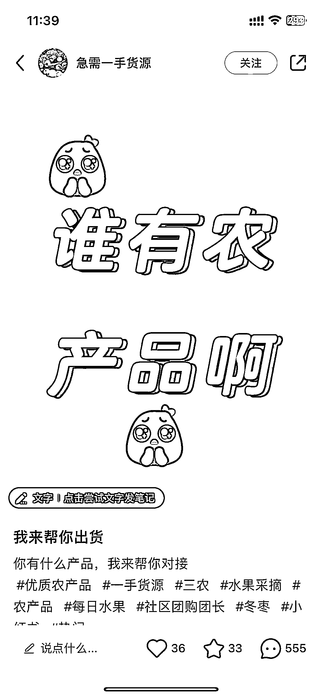
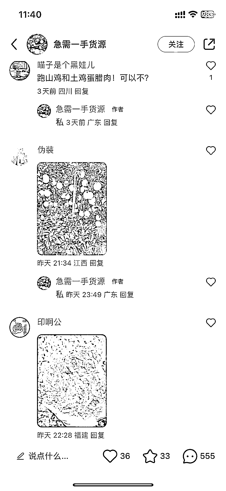
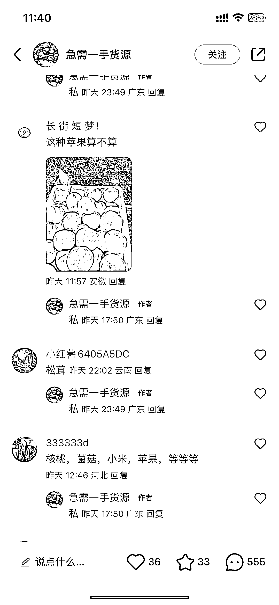
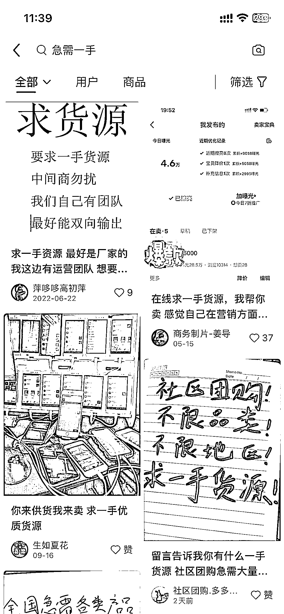

# 中间商在小红书寻找农产品货源供应，再转手给采购商

> 原文：[`www.yuque.com/for_lazy/xkrm14/zwi1iwd36005tb1q`](https://www.yuque.com/for_lazy/xkrm14/zwi1iwd36005tb1q)

作者： 英麒 Ryan

日期：2023-10-16

点赞数：**104**

* * *

正文：

中间商，在小红书发帖找农产品货源供应，再倒手给农产品采购商 这不就是无货源玩法吗 搜“急需一手”，还有其他行业的

* * *

评论区：

晨曦 : 小红书上有很多挂团长需要货源的

九京 : 这个思路牛逼。

九京 : 类似周末一起聚个餐，啥都有，就差瓶酒了，你带一瓶过来，哈哈。

* * *

公众号懒人找资源，懒人专属群分享