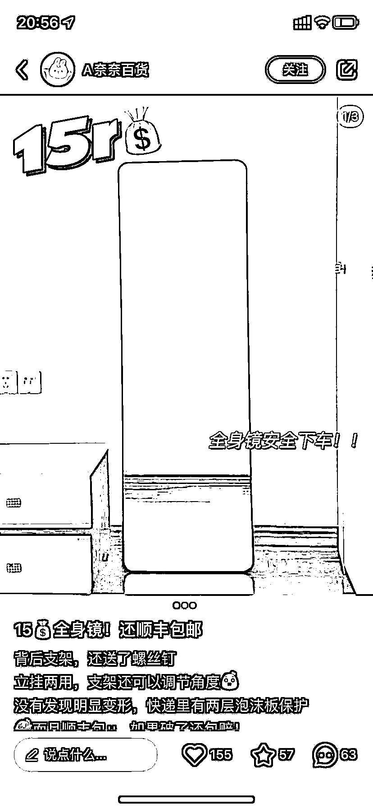
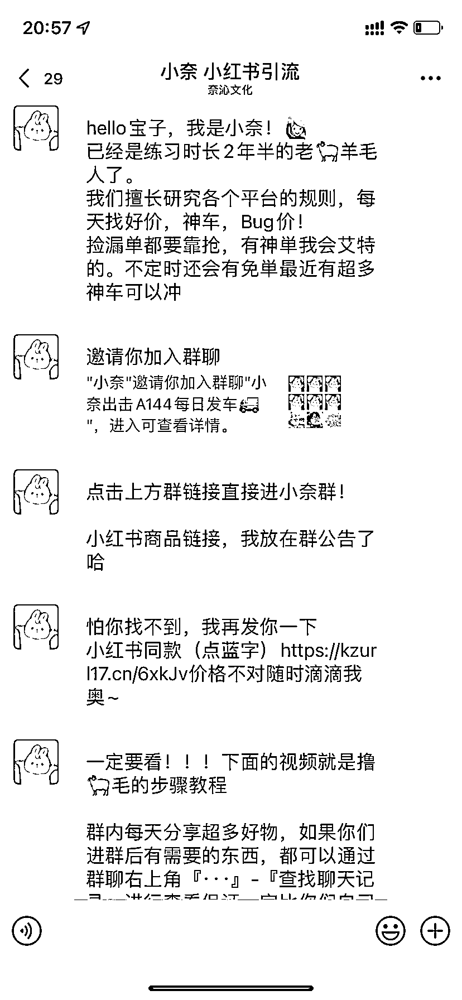

# 小红书发布超级性价比商品，引流企业微信拉群做淘宝客

> 原文：[`www.yuque.com/for_lazy/xkrm14/pg9yicdnyd7x6b6t`](https://www.yuque.com/for_lazy/xkrm14/pg9yicdnyd7x6b6t)

作者： 木头

日期：2023-10-25

点赞数：**42**

* * *

正文：

小红书发布超级性价比的商品引流到企业微信拉群做淘宝客！预计双十一还能爆发一波！最近这类的案例很多！还有免费做图片引流~后端流量的承接方式以及表现的路径基本一样！

* * *

评论区：

艾小飞 : 你留意到微信群里面发的产品，有小红书笔记里的产品吗

杨杨杨 : 我以前加过这种群，就没有宣传的那些东西

艾小飞 : 哈哈好深的套路啊

木头 : 没有~小红书的图没准都是 P 的😂

元 : 看过另一个圈友分享过这种玩法，用别人的美图拼成自己的，标上低价，引流到微信，朋友圈全是其他日用类的，和小红书图片展示的毫不相关

杨杨杨 : 对滴，都是假钩子引流

* * *

公众号懒人找资源，懒人专属群分享