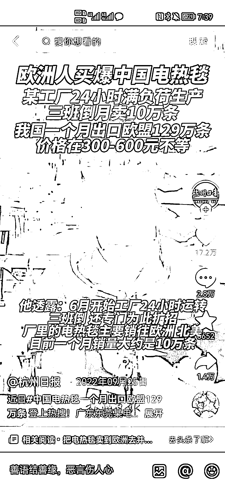

# 欧洲能源危机再次爆发，电热毯成为热销商品

> 原文：[`www.yuque.com/for_lazy/xkrm14/cuatc1cu1ct6c7tw`](https://www.yuque.com/for_lazy/xkrm14/cuatc1cu1ct6c7tw)

作者： 希平

日期：2023-10-20

点赞数：**113**

* * *

正文：

给欧洲卖电热毯、保暖内衣等用电 去年，俄乌冲突，欧洲制裁俄罗斯，导致欧洲人买爆电热毯（图 1） 据央视网报道，过去一周，欧洲天然气价格暴涨 40％（图 2）
据东方基金圆桌派报道，今年，欧洲将 1/3 能源转给以色列，结果巴以冲突爆发，以色列对巴勒斯坦宣战，随之关停了其中一个对外出口的天然气井口，而这个井口本来是经埃及，出口给欧洲的。（图 3）
也就是说，欧洲又得爆发一次能源危机了。做欧洲跨境的，可以考虑卖电热毯了[呲牙][呲牙][呲牙]

* * *

评论区：

展扬 : 我想起来了，去年俄乌冲突，彩虹电器股价一直涨，做电热毯的，有兴趣可以了解下。

* * *

公众号懒人找资源，懒人专属群分享