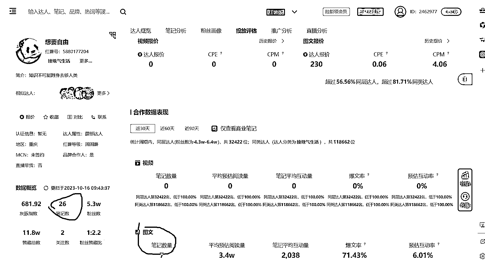
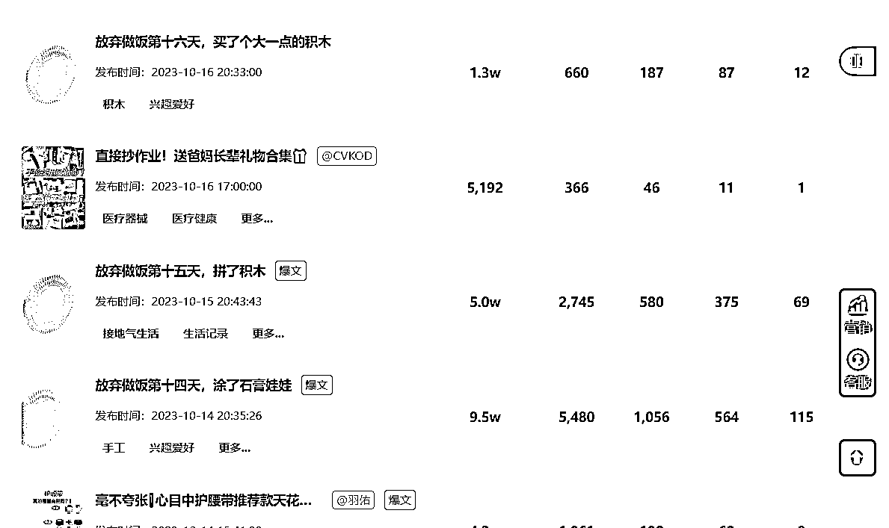

# 放弃做饭的连载引发女性共鸣，涨粉 5.3w 并接 7 条商单

> 原文：[`www.yuque.com/for_lazy/xkrm14/qqyaou7ak1xyw7gy`](https://www.yuque.com/for_lazy/xkrm14/qqyaou7ak1xyw7gy)

作者： 肖江波

日期：2023-10-18

点赞数：**110**

* * *

正文：

发了 26 条内容，涨粉 5.3w，已经接了 7 条商单。
内容形式也很简单：放弃做饭的第 x 天，引起了很多女性的共鸣，做了她们想做又不能做的事情，而且很多都在追后续，有点连载小说的意思。

* * *

评论区：

能量菌 : 你的号么？涨粉速度很快，现在已经 8.4 万粉了，后期怎么变现呢？

书含 : 刚特地去翻看了小红书账号，要不是看到这条帖子，一准以为是一宝妈的真实故事，关注点赞评论追更。账号流量就这么哗哗哗的涨起来了。

认知小窗-认哥 : 陪伴+情绪价值

better me : 太厉害了 9.4 万粉了

花猫（持续早起 100* : 我咋找不到

字节叔叔 : 好像是改名了（现在叫“自由”），红薯号也改了，刚刚看 10.0W 粉了

花猫（持续早起 100* : 看到了，谢谢

* * *

公众号懒人找资源，懒人专属群分享