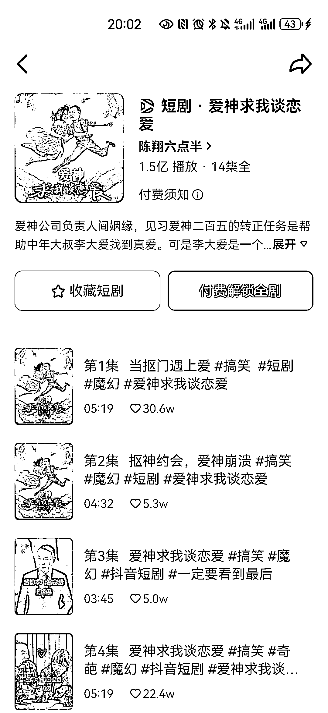
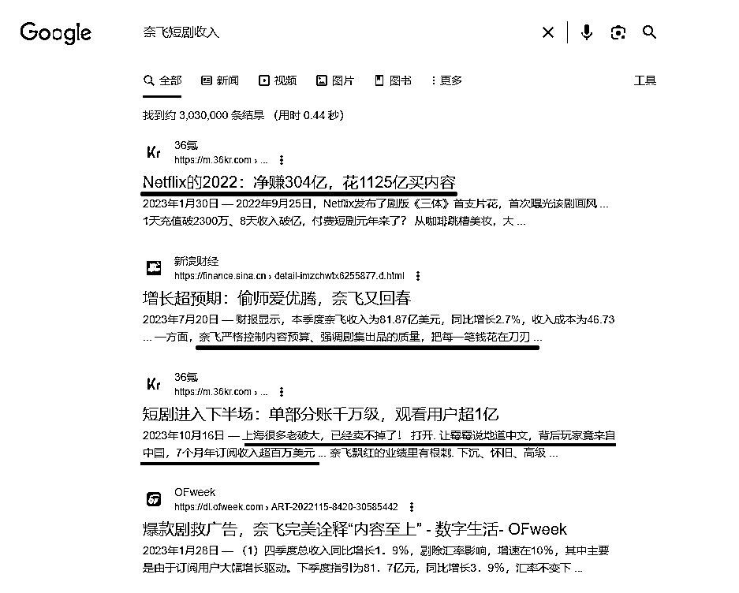

# 有传媒基因的 MCN 机构，考虑自制短剧，迎接市场前景

> 原文：[`www.yuque.com/for_lazy/xkrm14/pgly9bsfd15wvou3`](https://www.yuque.com/for_lazy/xkrm14/pgly9bsfd15wvou3)

作者： 希平

日期：2023-10-25

点赞数：**44**

* * *

正文：

有传媒基因的 mcn 机构，可以考虑做自制短剧
刚刚跟一个朋友聊天，我们聊到了国内的短视频头部达人，叫做陈翔六点半（图 1），最近推出了两部短剧，一部是爱神教我谈恋爱（图 2），一部是爱情魔法（图 3），均获得了过亿的播放量，并且配合抖音开启了付费观看的先河。
行情： 1.国外：目前短剧巨头奈飞，这是出品越狱（图 4）、纸钞屋（图 5）、纸牌屋等短剧的内容生产商，它去年花了 1000 亿买内容，净赚 300 亿（图 6）。
2.国内：巨头爱优腾抖音快手都在加码偷师，比如快手出品了《我回到 17 岁的理由》、抖音火爆的《逃出大英博物馆》（图 7），但总体投入才几十亿。
对比巨头奈飞十多年的发展，而我国的短剧，真正发展的元年是在 2020 年，也就是我国的短剧，还是处于萌芽期，市场有前景。
目前我了解到，不管是做数码的 mcn，还是做服装的服装孵化基地，都需要主播或达人去拍短视频获取流量。 那么可以更进一步，那就是把短视频剧情化。 数据源：
1\. 2\. 3.[短剧进入下半场：单部分账千万级，观看用户超 1 亿-36 氪](https://m.36kr.com/p/2477236790206594) [Netflix 的 2022：净赚 304 亿，花 1125 亿买内容，能否赢得三体宇宙争霸赛？-36 氪](https://m.36kr.com/p/2111230848859912) 增长超预期：偷师爱优腾，奈飞又回春 _ 手机新浪网

imzchwtx6255877.d.html?vt=4&cid=206650&node_id=206650)

* * *

评论区：

* * *

公众号懒人找资源，懒人专属群分享