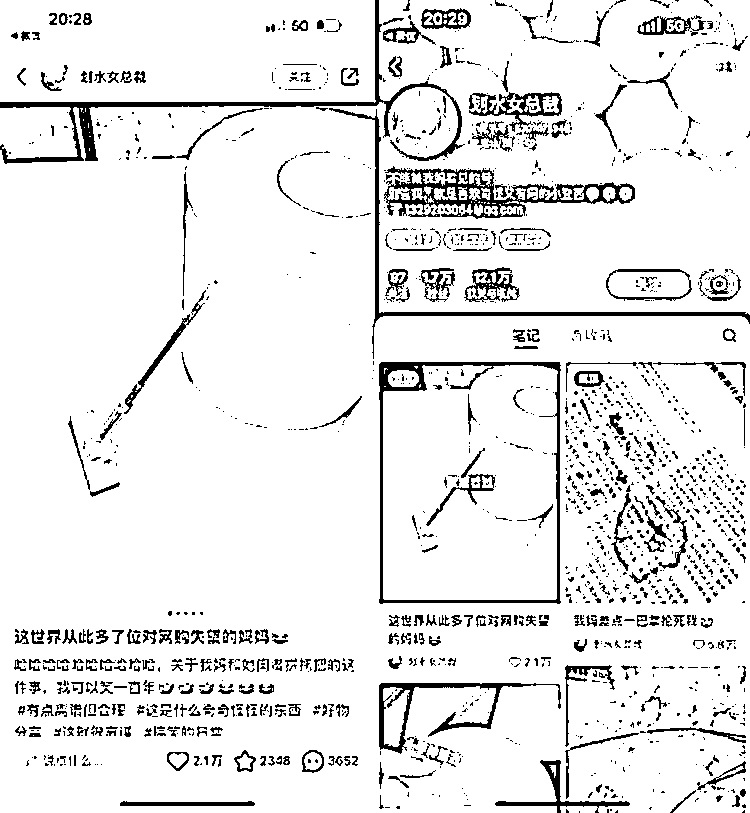

# 可复制的小红书玩法：新奇特家居玩具系列

> 原文：[`www.yuque.com/for_lazy/xkrm14/bu7s30gpngl1fv8u`](https://www.yuque.com/for_lazy/xkrm14/bu7s30gpngl1fv8u)

作者： 蔡文静好文静

日期：2023-10-23

点赞数：**78**

* * *

正文：

可复制的小红书玩法：新奇特 x 家居玩具系列 数据展现：81 个笔记，1.7w 粉丝，广告报价单篇 1500 内容玩法：
1、可以在拼夕夕 tb 等找到各类新奇特/稀奇古怪小玩具，采购成本较低，且拍摄比较简单 2、选品产品是核心：有趣、有意思，给人意想不到，还能这样
3、标题场景化，真实体现由产品所延伸出来具体场景的感受。也可以来源于一些热评 变现方式： 1、接各类商业广告
2.未来可以内容带货，卖这种有趣小玩具，或者复刻 1：1 模型的真实产品

* * *

评论区：

艾小飞 : 静姐，期待你下次分享些小红书私域的思路[旺柴]

* * *

公众号懒人找资源，懒人专属群分享