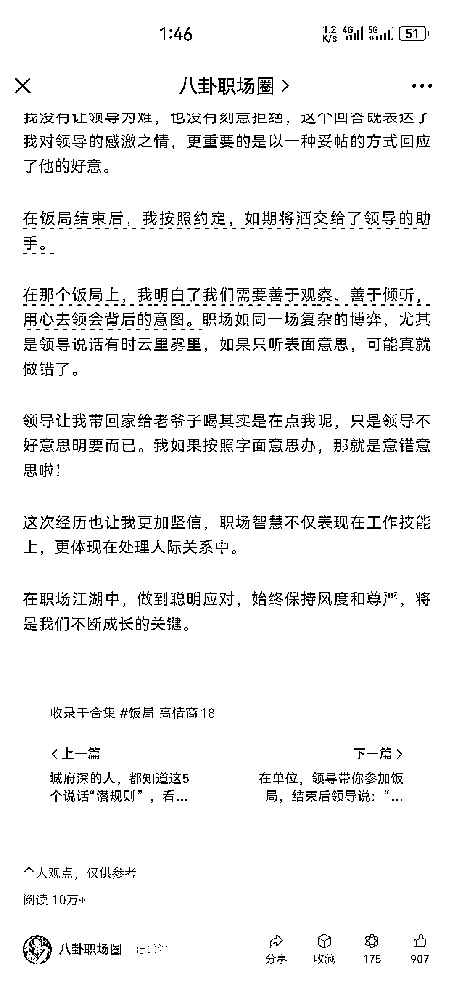

# 利用热点写爆文，抖音上的职场热点再次改编，公众号爆发概率更高

> 原文：[`www.yuque.com/for_lazy/xkrm14/mqe5wmc7t7ezgy2l`](https://www.yuque.com/for_lazy/xkrm14/mqe5wmc7t7ezgy2l)

作者： 未见青山

日期：2023-11-01

点赞数：**88**

* * *

正文：

利用热点写爆文，之前抖音上很火的热点，就是在职场上碰到这些情况你应该怎么做，评论区里干啥的都有，山东的正确公务员模板，以及江西的莽撞人模板，结合到一起点赞评论量很高，以这个热点来发公众号，好几篇 10w+，这样来看，是不是说抖音上，快手上这些短视频平台火过的内容再次改变一下发到公众号上是不是活的概率跟大一点呢，
这个号是 9 月份起的号，现在已经好几篇 10w+了

* * *

评论区：

花闲 : 怎么搜不到，关注不了呢？

未见青山 : 这个我也不太清楚，我搜了半天也搜不到，有没有知道怎么搜的大佬帮忙提供一下方法[捂脸]

土豆先生 : 这种搜不到的是因为号被限制了么？

未见青山 : 感谢亦仁老大[坏笑]

未见青山 : 也可能是，但是我能在看一看刷到，就很奇怪

土豆先生 : 我有个手机能搜到他，但是另外一个手机搜不到。挺神奇的

金九渊 : 搜不到，最近还有更新么？

* * *

