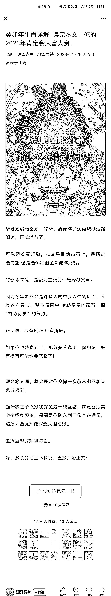

# 公众号玄学领域付费文

> 原文：[`www.yuque.com/for_lazy/xkrm14/mfggbhgcym9grzd3`](https://www.yuque.com/for_lazy/xkrm14/mfggbhgcym9grzd3)

作者： TTTTL

日期：2023-11-02

点赞数：**102**

* * *

正文：

公众号玄学领域付费文 一篇文章创收 60w 而且这个号不止一篇付费文章，很多篇的收入都达到了 10w 的创收（就是这个领域有点擦边）

* * *

评论区：

饶小编 : 为啥说这个领域擦边？这算是心灵鸡汤，还是生肖命运啥的？

远方 : 这是个存在 N 多年的老大号，讲人情世故，说人生命理，阅读群体基本女性。从过往文章中海量女性留言可以看出。他的主要收入应该是找他看命理的高额收费。

小魏从 0 开始做副业 : 这个属于大 V 了吧

朝暮拾花 : 他的看事价格太高了，三万起步

老张 : 很老的号了[晕]我关注了很久

陆小凤 : 算是这个领域的超级大 V 了

热心网友大表哥 : 老号了，粉丝粘性很高

* * *

公众号懒人找资源，懒人专属群分享