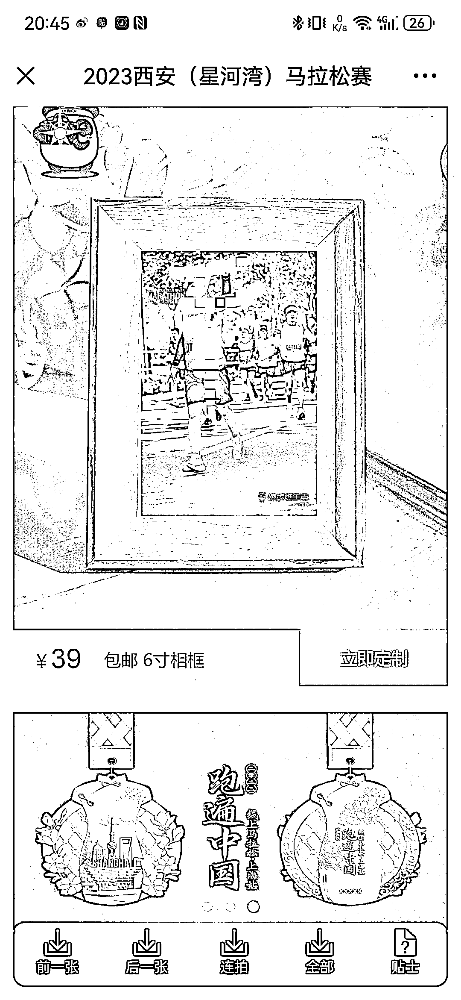
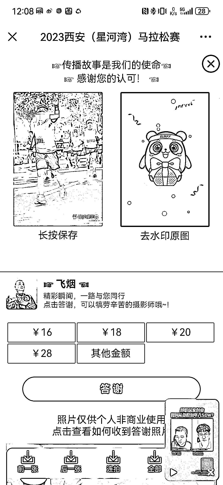
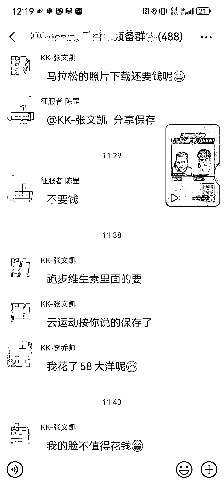
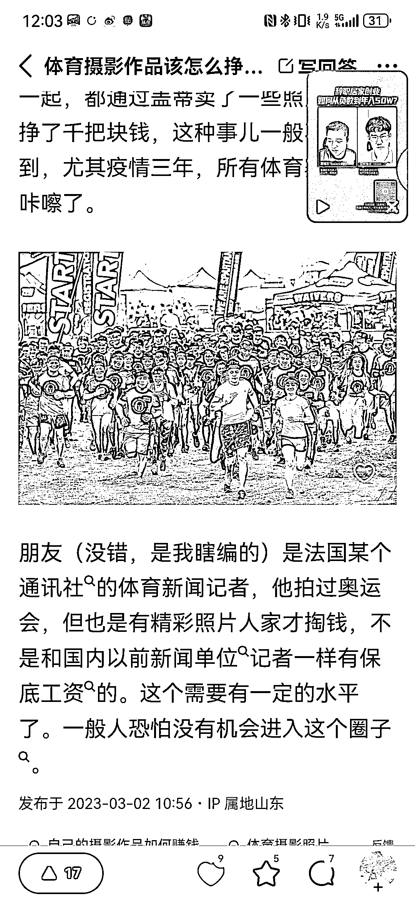

# 马拉松照片这几个公众号平台找自己的照片，但要下载照片都要是要付费

> 原文：[`www.yuque.com/for_lazy/xkrm14/rr7ua845spi7li54`](https://www.yuque.com/for_lazy/xkrm14/rr7ua845spi7li54)

作者： 恐惧与贪婪

日期：2023-10-30

点赞数：**47**

* * *

正文：

参加了一场马拉松，赛场里有很多拍照的摄影师，赛后通过自己的参赛号在，跑步维生素，爱运动，马拉松照片这几个公众号平台找自己的照片，但要下载照片都要是要付费的，
和拍结婚照有点类似，妹子的钱💰应该好赚吧，前提是抓拍的要在妹子的审美上，我是有点舍不得。 还有升级服务，给直接给你的照片搞成相框相框样式自助选包邮。
但跑步的圈友花了 58 元下载了。是个男圈友，说明市场还是有啊。

* * *

评论区：

恐惧与贪婪 : 感谢老大🙏 小小的分享大大的收获[耶]

恐惧与贪婪 : 跑步四万人，每个人几乎都会被照上，而且不止是一张，我在几个平台上看了一下。我起码有十几张了[呲牙]

胖大魔 : [奸笑]以前能跑的时候，随便咋拍都行。现在照片拍出来就

张万敏 : 原来马拉松摄影师这样赚钱

恐惧与贪婪 : 是啊，自己体验了才知道。

恐惧与贪婪 : [憨笑]今时不同往日

* * *

公众号懒人找资源，懒人专属群分享