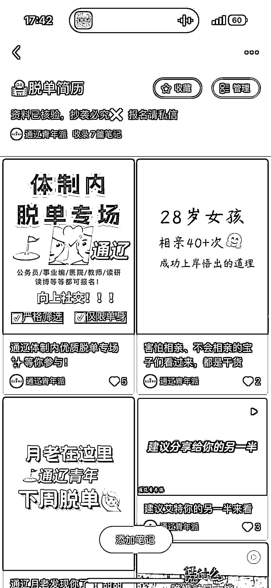

# 小红书推出“同城脱单交友”会员服务，引流高净值客户的情感课程

> 原文：[`www.yuque.com/for_lazy/xkrm14/wek0kp6h19kgklsz`](https://www.yuque.com/for_lazy/xkrm14/wek0kp6h19kgklsz)

作者： 武雨菲

日期：2023-10-31

点赞数：**73**

* * *

正文：

小红书“同城脱单交友”招募会员，门槛 49.9💰作为引流产品。为体制内圈子小、寻求脱单的年轻人，以及上班族提供情感服务、报名引流到私域后，筛选高净值客户提供情感课程 499💰付费课程。

* * *

评论区：

张万敏 : 相亲，处对象，脱单的小红书帖子流量挺不错

武雨菲 : 😁再接再厉

* * *

