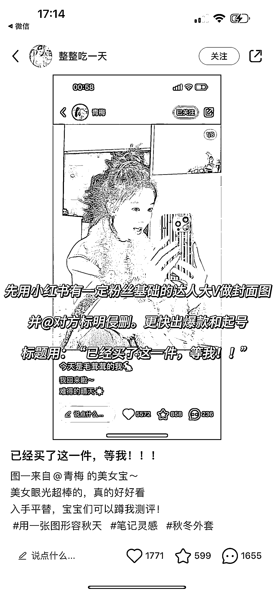
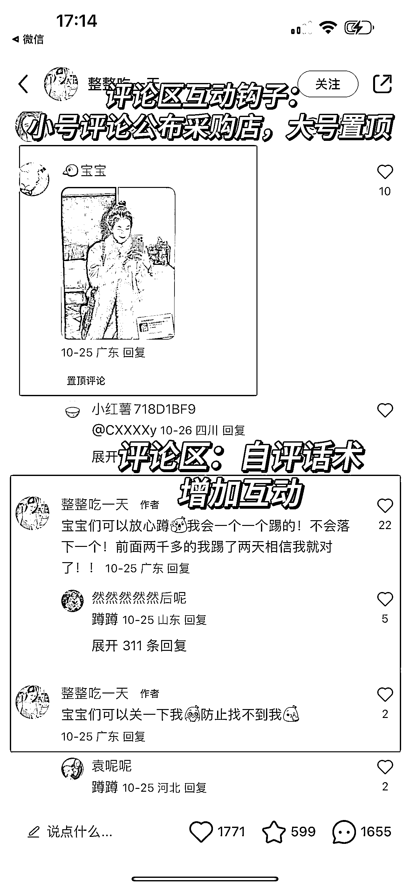

# 可复制的小红书玩法：服装穿搭 x 测评记录，涨粉 1 万+

> 原文：[`www.yuque.com/for_lazy/xkrm14/tpp4ge6ggli9m7n9`](https://www.yuque.com/for_lazy/xkrm14/tpp4ge6ggli9m7n9)

作者： 蔡文静好文静

日期：2023-11-03

点赞数：**150**

* * *

正文：

可复制的小红书玩法：服装穿搭 x 测评记录，涨粉 1 万+ 内容玩法： 1、先用小红书有一定粉丝基础的达人大 V 做封面图，并@对方标明侵删。更快出爆款和起号
标题用：“已经买了这一件，等我！！” 2、后续第二篇笔记，是用‘刚拿到的快递。想立马跟你们分享’。同步出自己 ip 属性
从购买到试穿测品，都记录下来。主打真实测评 3、其他行业复用：其他家居好物等好物，都可以参考这个内容打法 评论区互动/引流钩子：
1、小号评论公布采购店，大号置顶 2、宝宝们可以放心蹲我会一个一个踢的！不会落下一个！前面两千多的我踢了两天相信我就对了！！ 变现方式：
1、这种测评方式可以快速起号，接广告 2、后期还可以自己开店带货，甚至挂载带货也可以 3、还可以引流私域做变现

* * *

评论区：

能量菌 : 封面图也可以用抖音大 V 的封面图吧

能量菌 : 小号评论公布采购店是到淘宝或者 pdd 吗？还有“放心蹲我会一个一个踢的”啥意思[捂脸]

bgz 洲洲 : 可行！类似抖音上的测评流程，只不过换成图文格式，分批次发布

元 : 你蹲着我踢你，就是我会互动你的意思，就是会私信你啦

元 : 感觉这个是往测评号发展，然后再带货吧

* * *

