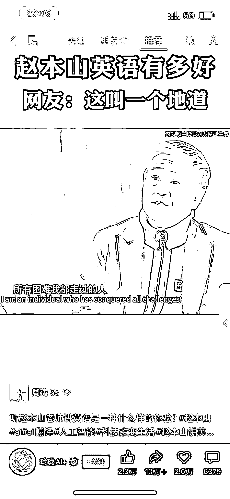

# AI 视频生成神器，让语言不再成障碍！两种方式实现口型自然的多语言转换

> 原文：[`www.yuque.com/for_lazy/xkrm14/vpngo1mmeg4ilft8`](https://www.yuque.com/for_lazy/xkrm14/vpngo1mmeg4ilft8)

作者： 猫哥

日期：2023-10-31

点赞数：**86**

* * *

正文：

AI 视频生成神器！让老外说中文，中国人说英文。口型自然，不限语言，多用途。实现这个效果用到的软件（2 种方式）： 1，收费版：Heygen
（免费额度只有 1 分钟） 2，免费版：语音转文字：Whisper。文字转对应口型：一键生成对口型视频！数字人说话工具 Wav2Lip 离线版 V1.0

* * *

评论区：

米多利 : 第二个声音能做到么

一朵云 : 第二个效果如何？

猫哥 : 可以的 有专门的教程

猫哥 : 第一次中！谢谢老大

橙汁🍊 : 想问一下第二个是输入哪个网站

猫哥 : 零度解说

橙汁🍊 : 谢谢 虽然没听懂

* * *

公众号懒人找资源，懒人专属群分享