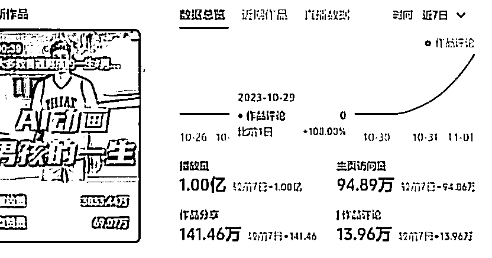

# AI 动画《Animatediff》成为风向标，播放量过亿，赞数持续攀升

> 原文：[`www.yuque.com/for_lazy/xkrm14/vn4lz8hodfhl1py9`](https://www.yuque.com/for_lazy/xkrm14/vn4lz8hodfhl1py9)

作者： 吴东子

日期：2023-11-02

点赞数：**119**

* * *

正文：

分享一个风向标 播放量直接过亿，主页访问量也近百万
用 Animatediff 做 AI 动画，前天一期抖音 200w 赞，昨天一期 68w 赞，估计最后也能破百万赞，而这还只是第二期 ​
​在 AI 这行呆得越久，经历的小周期越多，越能看清一些东西，基本上每隔一段时间就会出来一个好玩的，里面就蕴含了非常多套利的机会
可以类比上一个这样爆火的 AI 内容

* * *

评论区：

酱油 : 期待大佬们出教程

易水 : 同样期待大佬出教程

一朵云 : 电脑配置要求太高了，花了一天时间弄云部署没弄出来[流泪]

 杰克船长 🍼 : 推上看到过第二个视频

* * *

公众号懒人找资源，懒人专属群分享