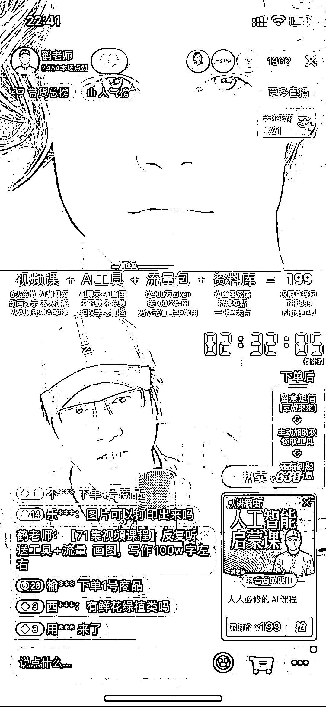
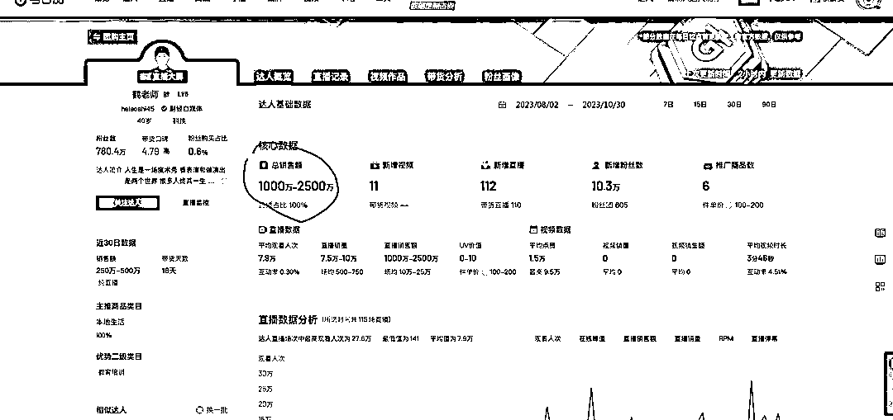
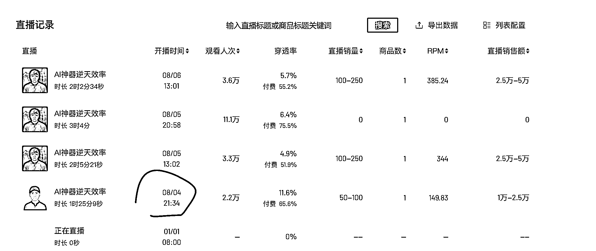

# 鹤老师 Ai 课程 3 个月卖了 2 千多万，AiGC 领域发财方向

> 原文：[`www.yuque.com/for_lazy/xkrm14/kxfeb9wt1f3tm045`](https://www.yuque.com/for_lazy/xkrm14/kxfeb9wt1f3tm045)

作者： 袁石石

日期：2023-11-01

点赞数：**64**

* * *

正文：

鹤老师针对小白的 Ai 课程 3 个月卖了 2 千多万（纯利）😂
199 课包含了：（71 节视频课+Ai 工具包+流量包+资料库）视频课别看有 71 节，其实每节只有几分钟，总体也就一个多小时，这里面内容对于做这块的圈友来说执行力拉满一周就差不多完成了[呲牙]
虽然现在 AiGC 如日中天，但其实抛开同行，身边没有几个人真的接触过，更别说能玩好。
AiGC 应用领域针对个人或企业服务，这个万亿级别行业目前还只是属于萌芽期，对于创业者真是一个发财的方向[呲牙]💰（而且大家起步都一样从 0 开始，比的是执行力）
PS：对 AIGC 领域感兴趣的多去 X 上关注几个这个领域大 V 保持行业发展前沿信息

* * *

评论区：

佰亮 : 他这个核心是工具➕流量包

张万敏 : 销售额数据在哪里看到的

米斯特 LIu : 这个主播我记得一直讲的是内容，关于房产还是啥的来着。

袁石石 : 工具和流量包很好解决，流量第一次送个百来张后面需要客户自己续费。主要核心是他整个交付闭环链接搭建完成了，对小白来说可以直接玩了

袁石石 : 考古加

袁石石 : 和李一舟差不多都是知识付费领域，根据市场趋势卖课卖认知

wyply115 : 我买过，工具不是很好用已经不用了[擦汗][擦汗]

wyply115 : 课程也看了一半吧 实在太小白了[撇嘴]

* * *

