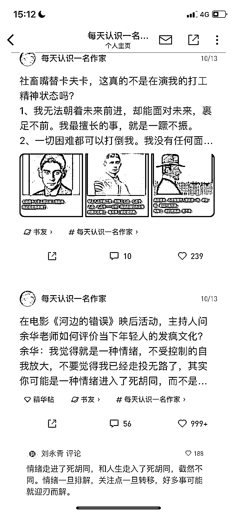

# 微信读书“每天认识一名作家”账号涨粉快，内容低成本制作

> 原文：[`www.yuque.com/for_lazy/xkrm14/wgmflxzm5bnobgve`](https://www.yuque.com/for_lazy/xkrm14/wgmflxzm5bnobgve)

作者： 罗破帽

日期：2023-10-30

点赞数：**87**

* * *

正文：

【微信读书“每天认识一名作家”账号涨粉快】
a.这个账号涨粉很快，10 月 13 日开始更新，每天发布 3 条帖子。之前粉丝数是 1485 个粉丝，大概过 10 天左右，再看这个账号的时候，粉丝数已经涨到 3022 个粉丝。71 篇帖子中，999➕喜欢的有 9 篇，超过 100 个喜欢的帖子有 17 篇帖子。
b.内容：介绍作家的成长经历、配上作家的人物图或金句图。内容制作成本低，可以用 GPT 批量生成。
c.引流：第一种方式在微信读书关注自己的公众号，然后后台设置关注公众号后自动弹出二维码。第二种：账号主页设置添加微信，免费送价值 xxx 资料。
d.变现：共读营、打卡营、写作营等。

* * *

评论区：

Chris : 在微信读书刷到过

九歌 : 小红书也可以做

西昂 : 真是火过的东西，换个平台照样火。

* * *

