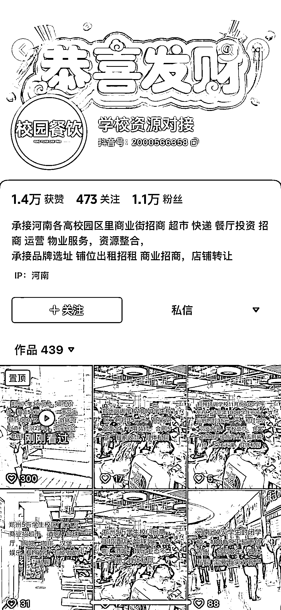

# 细分赛道中介：信息差的利润机会

> 原文：[`www.yuque.com/for_lazy/xkrm14/kach84d6vk0ex3e2`](https://www.yuque.com/for_lazy/xkrm14/kach84d6vk0ex3e2)

作者： 健叔的 jian

日期：2023-10-30

点赞数：**53**

* * *

正文：

资源对接 大赛道下的细分赛道，做好中介也能收获不少利润，本质打一个信息差，暖意久了就成了资源差了。

* * *

评论区：

勿以恶小而为之 : [强][强][强]

* * *

公众号懒人找资源，懒人专属群分享