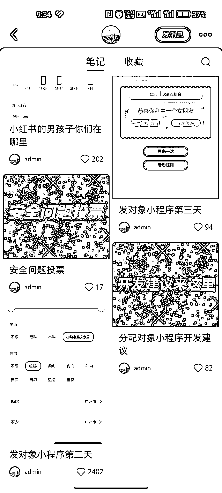

# 养成系相亲小程序，提前锁定 1000+精准人群，完整闭环引流玩法

> 原文：[`www.yuque.com/for_lazy/xkrm14/mfv2014dcqlbn5vc`](https://www.yuque.com/for_lazy/xkrm14/mfv2014dcqlbn5vc)

作者： 子凌

日期：2023-11-01

点赞数：**66**

* * *

正文：

看到一个养成系相亲小程序制作博主，每隔一段时间发布小程序的动态或者给到大家一些点让大家提建议，并在笔记里置入了群聊，目前有 3 个群等于提前锁定了 1000+精准人群。达到提前锁定人群+小程序的完善优化。流量有了，产品也有了，现在就是等程序上线。最后小红书预热，引到小程序，小程序转到私域承接流量，完整的闭环。后期玩法就很多了。小红书男女比例相差巨大，个人很看好相亲在这个平台上。

* * *

评论区：

子凌 : 再补充一个点，看到作者有在评论说缺小程序制作相关人员，直接从评论里链接，达到小程序精准用户+员工双重绑定。也可以和猎头合作转到私域，工作+相亲大部分人都有很大的需求。

子凌 : [呲牙]

* * *

