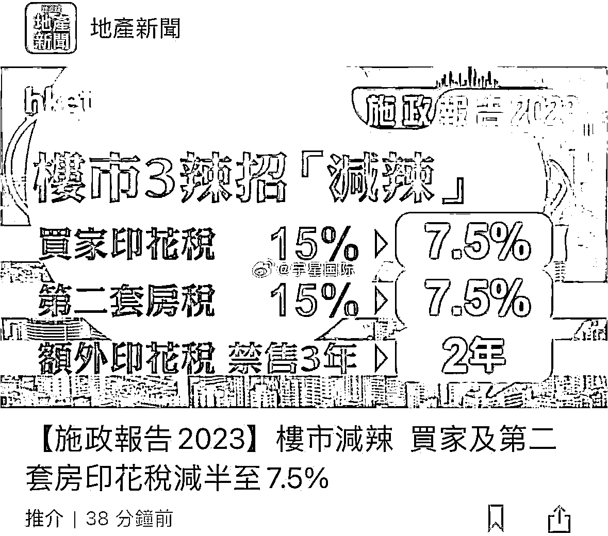
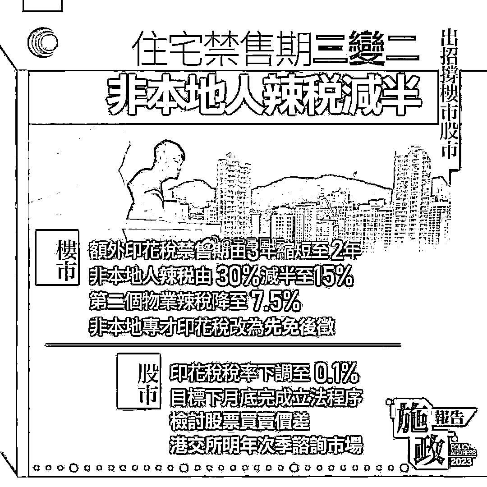
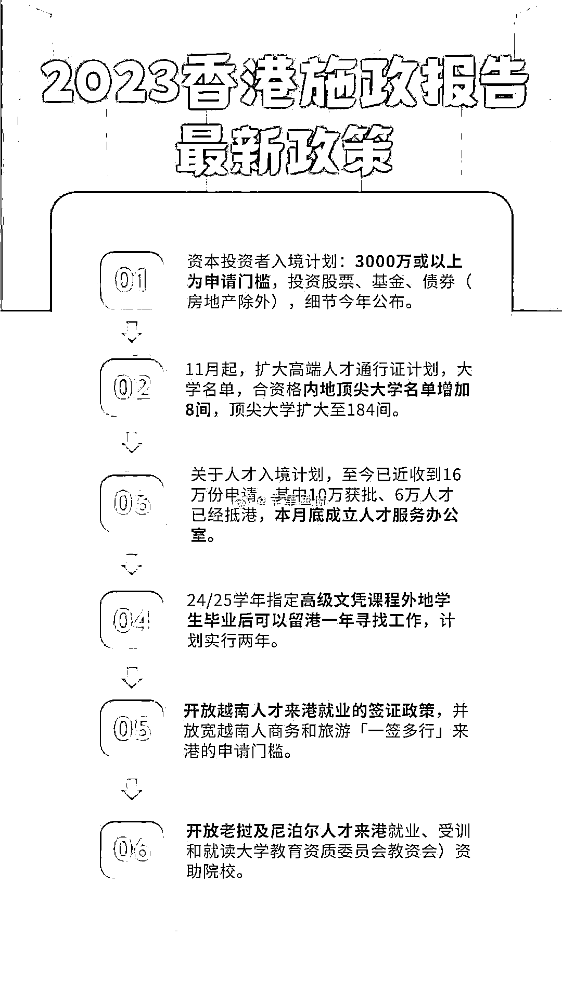

# 大湾区房市放松政策，信息差带来其他机会

> 原文：[`www.yuque.com/for_lazy/xkrm14/gnfl40wvw0h56ycn`](https://www.yuque.com/for_lazy/xkrm14/gnfl40wvw0h56ycn)

作者： 李纳

日期：2023-10-31

点赞数：**37**

* * *

正文：

大湾区房市及信息差其他机会 最近香港买房政策松动，先有之前港人抢新楼，主力也是小户型 30-40 平方米几百万房型为主。
现有香港为与其他城市竞争，“减辣”降税、先免后征等政策，小户型几百万房型也是“专才”“人才”勉强打工几十年够得着的房型。 可利用信息差： 买卖房产中介
香港身份中介 投资中介--房产投资或者利率套利或者其他资产投资 保险中介 留学中介 “优才计划”中介

* * *

评论区：

胖大魔 : 前几天看大屁股公众号说香港身份 3000 万性价比不高

* * *

