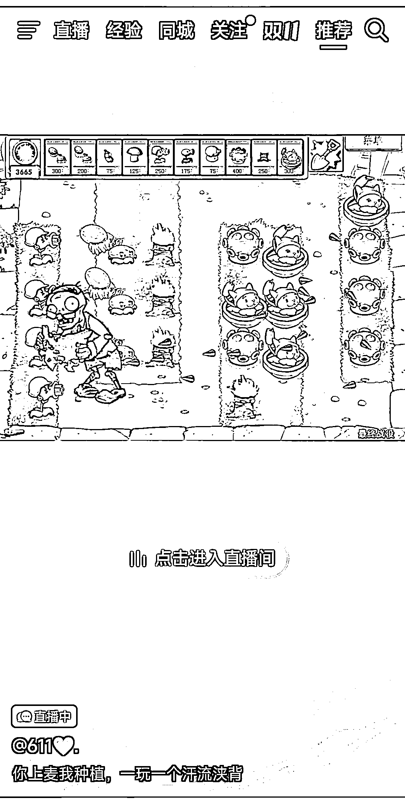

# 直播老游戏，加入互动元素，观众挑战打塔防，有奖励和节目效果

> 原文：[`www.yuque.com/for_lazy/xkrm14/braat1l0gkyfkig4`](https://www.yuque.com/for_lazy/xkrm14/braat1l0gkyfkig4)

作者： 易从容

日期：2023-10-31

点赞数：**34**

* * *

正文：

直播老游戏，用修改器修改一些参数，加入互动元素。
比如这个直播里面就是邀请观众挑战打塔防，首先让观众喊停随机抽取道具卡栏，然后用道具栏的卡片放置植物作为防御方挑战，挑战成功有奖励，失败和玩得起的观众做节目效果。
盈利模式：一般如果想要连线需要上墨镜才能连上。会做出比较火爆的连线状态。

* * *

评论区：

易从容 : 几个直播间都是两千人以上的数据

小金（泓壹） : 请教下修改器是？

晓光 : 某宝、拼夕夕都是几块钱，带修改器的

* * *

