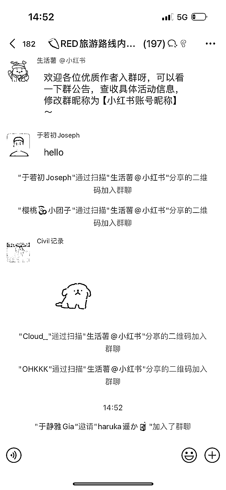
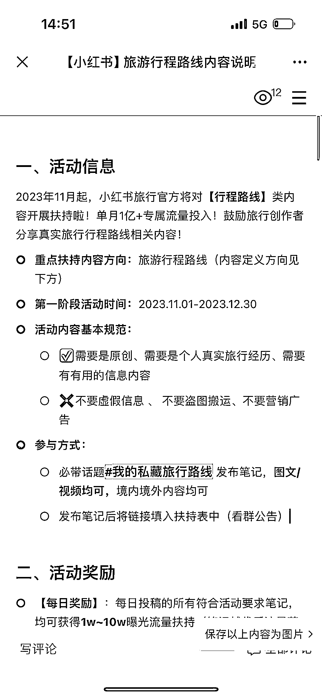
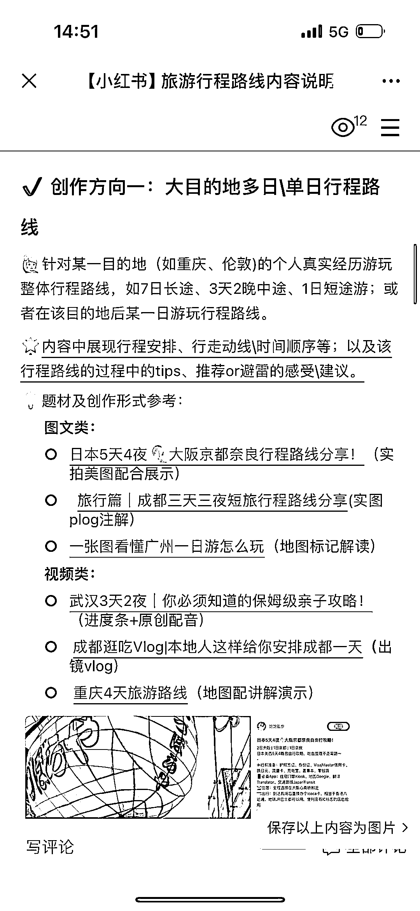
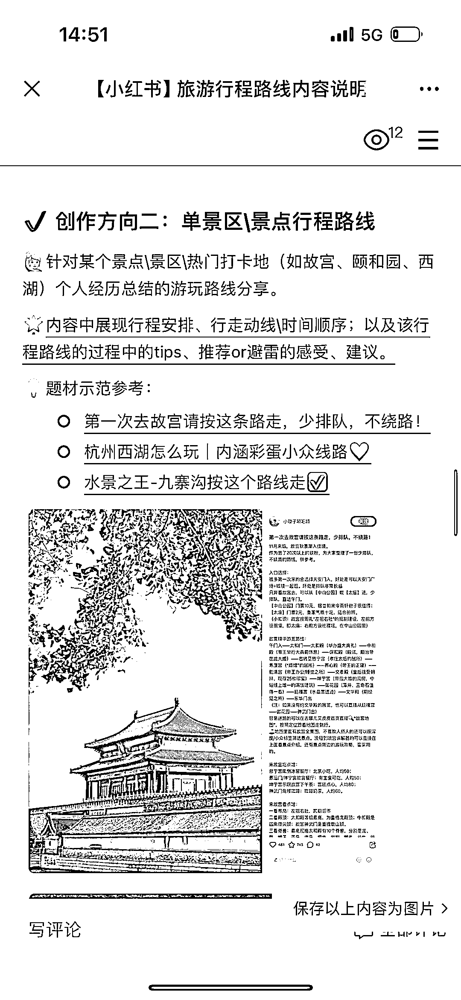
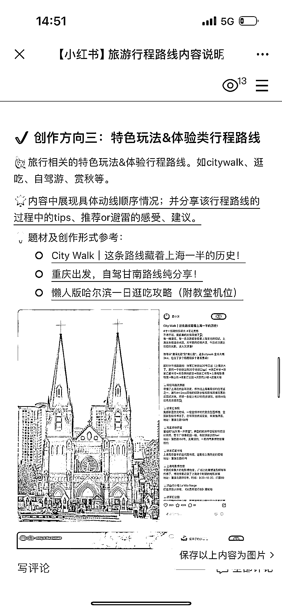

# 小红书邀约旅游博主，真实行程路线获流量，警示假攻略危险

> 原文：[`www.yuque.com/for_lazy/xkrm14/bmh5s5g9xzo076u9`](https://www.yuque.com/for_lazy/xkrm14/bmh5s5g9xzo076u9)

作者： better me

日期：2023-11-07

点赞数：**89**

* * *

正文：

小红书主动邀约旅游类博主做 行程路线 类真实的内容，对这些内容进行流量扶持，符合要求每篇笔记可以获得 1w-10w 的流量。做旅游的快搞起来！！！
同时也放出个信号，套路化无真实感的假攻略形式内容危险了

* * *

评论区：

远方 : 你好，请问这个链接地址有吗，想了解一下[抱拳]

能量菌 : 可能每个主题都会定向邀约和流量扶持

毕 : 同问链接

better me : [企业微信文档](https://doc.weixin.qq.com/doc/w3_AT8AiAYUAGQxR0zENaDTRy8Hgy3Gm?scode=ANAAyQcbAAguWY01ncAT8AiAYUAGQis_external=1commentVersion=1698913668000doc_title) 

better me : [企业微信文档](https://doc.weixin.qq.com/doc/w3_AT8AiAYUAGQxR0zENaDTRy8Hgy3Gm?scode=ANAAyQcbAAguWY01ncAT8AiAYUAGQis_external=1commentVersion=1698913668000doc_title) 

毕 : 感谢感谢

远方 : 非常感谢[抱拳]

* * *

公众号懒人找资源，懒人专属群分享