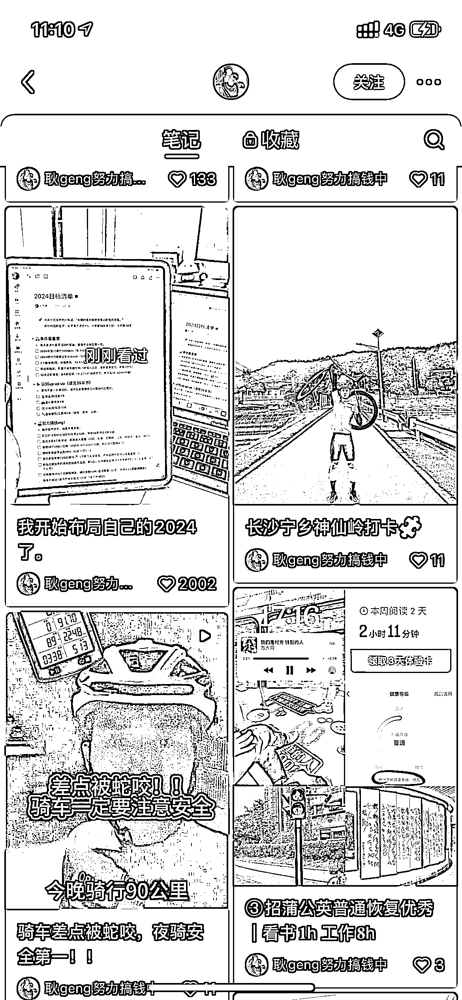
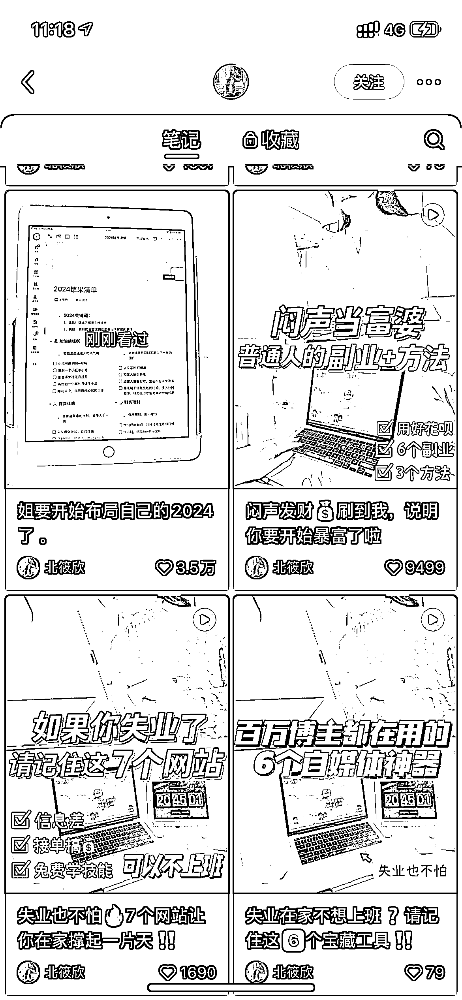
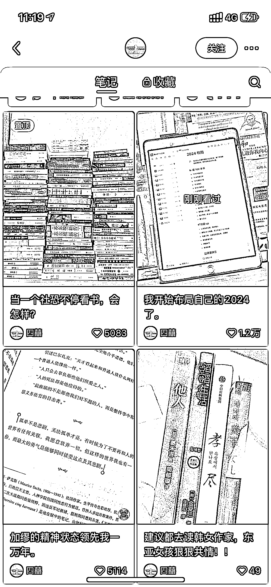
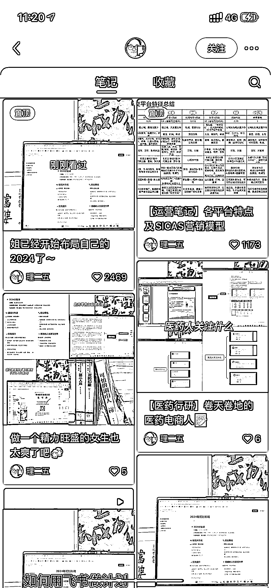
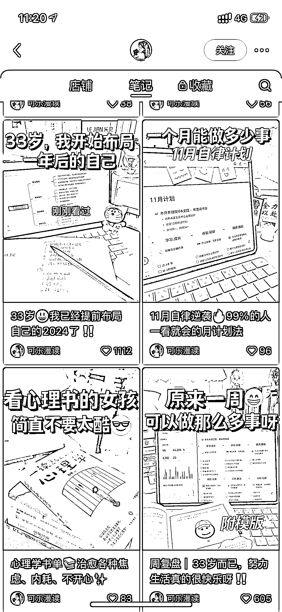

# 小红书热议 2024，数据异常值

> 原文：[`www.yuque.com/for_lazy/xkrm14/bss9c5puy458hfh8`](https://www.yuque.com/for_lazy/xkrm14/bss9c5puy458hfh8)

作者： annabelle.

日期：2023-11-09

点赞数：**106**

* * *

正文：

小红书最近这个话题很火：开始布局自己的 2024。 每个号这个话题的数据格外好，算是个异常值。

* * *

评论区：

恒一 : 可以的弄

能量菌 : [强]

王国庆 : 学习了

annabelle. : 感谢老大~

朝暮拾花 : 准备开搞

* * *

