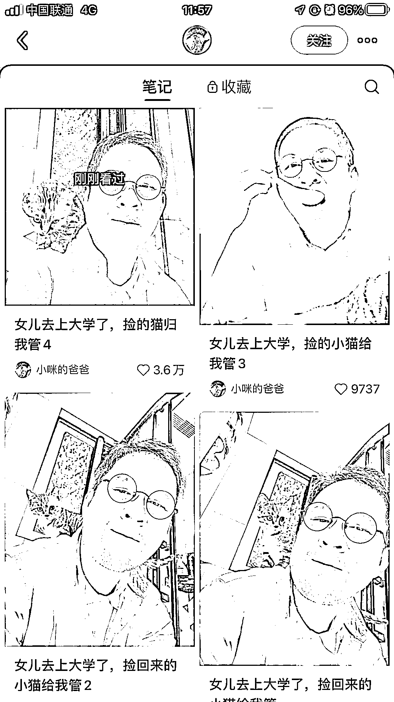
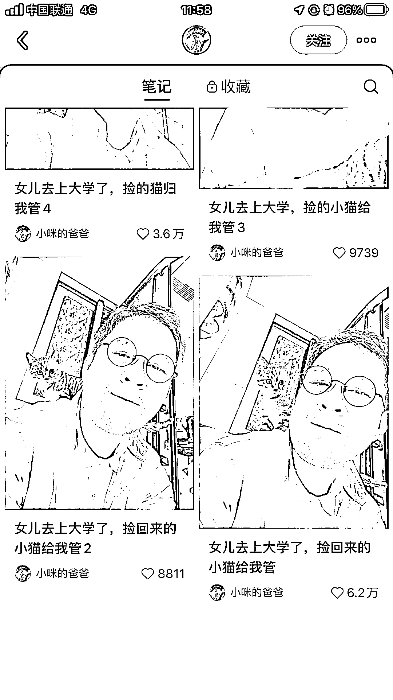

# 小红书流量秘诀：反差+真实，中老年 ip 的成功案例

> 原文：[`www.yuque.com/for_lazy/xkrm14/sw7uta27nfrho3xv`](https://www.yuque.com/for_lazy/xkrm14/sw7uta27nfrho3xv)

作者： 惠玲

日期：2023-11-09

点赞数：**72**

* * *

正文：

小红书流量秘诀：反差+真实 这个号，总共才发了 6 条笔记，已经 1 万粉了，而且第一条帖子就爆了，后面的每个帖子都很多点赞评论。 中老年 ip 做小红书真香啊。

* * *

评论区：

惠玲 : 谢谢亦仁大大！[害羞][害羞]

一只鸵鸟 : ⬇️⬇️

惠玲 : 哇，评论也很好耶！

* * *

