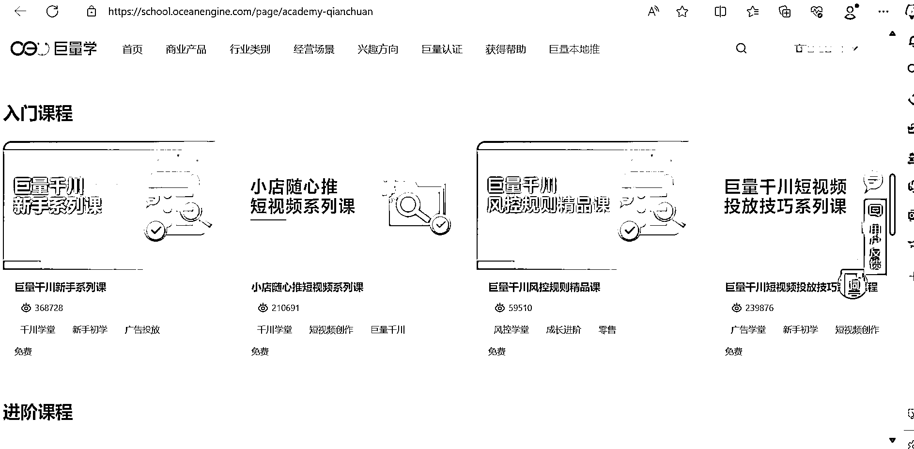

# 抖音付费投流学习渠道推荐，但品选和主播能力同样重要

> 原文：[`www.yuque.com/for_lazy/xkrm14/sbz3eopc3v9rkp1p`](https://www.yuque.com/for_lazy/xkrm14/sbz3eopc3v9rkp1p)

作者： 书豪

日期：2023-11-07

点赞数：**75**

* * *

正文：

很多赚钱圈友问我怎么学抖音付费投流，其实大可不必花钱学。
如果是小白或者刚入门，在抖音巨量大学官方网站学习就可以了，网站给大家贴在这里了。进去后搜千川就可以了 新手入门付费投流，最好的学习渠道就是官方网站。
但是付费流量不是雪中送炭，只是锦上添花。 如果你的品选的不好，也很难有利润。
如果你付费流量舍得砸钱，主播没有承接流量的能力，也容易亏钱。[巨量学官网｜短视频运营*直播运营*电商直播运营培训课程](https://school.oceanengine.com/) 

* * *

评论区：

希平 : 其实官方课程一般都是最好的，毕竟内部人员

书豪 : 正解，实操熟悉了进阶是另外一个层面

能量菌 : 是的

书豪 : 感谢老大，一顿猛干！

* * *

公众号懒人找资源，懒人专属群分享