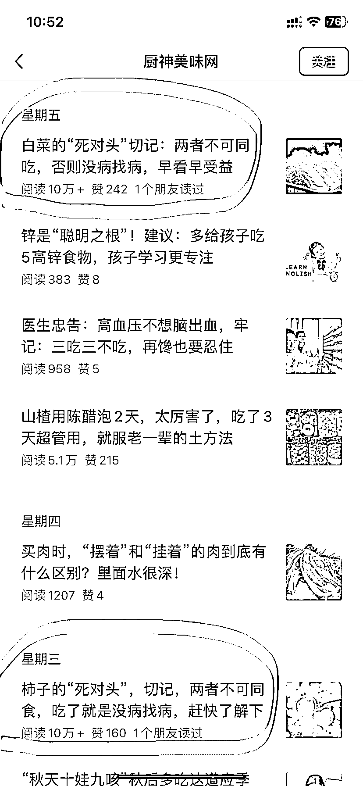

# 公众号美食分类爆款标题模版，多篇 10w+阅读量

> 原文：[`www.yuque.com/for_lazy/xkrm14/gxk59ob9erwa6kqa`](https://www.yuque.com/for_lazy/xkrm14/gxk59ob9erwa6kqa)

作者： 晓光

日期：2023-11-07

点赞数：**129**

* * *

正文：

公众号美食分类爆款标题模版，多篇 10w+。 这个公众号通过一个爆款模版：“xxx 的死对头”，阅读量爆炸，还有其他句型也有多篇高阅读，值得参考。

* * *

评论区：

能量菌 : 优秀

战实 : 和你看到了相同的内容。

米斯特 LIu : 不知道这个赛道收益如何

Cobb : 优秀

老彭 : 以前在头条百家流行的爆款标题，现在也在公众号流行了！！（大家可以收集百家头条的爆款文章，以及寻找对标来做）

晓光 : 这么多十万+，哪怕单价低也有大几百的

* * *

