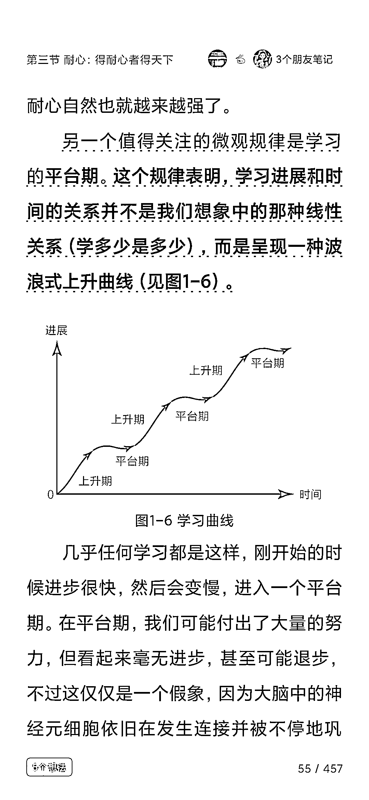
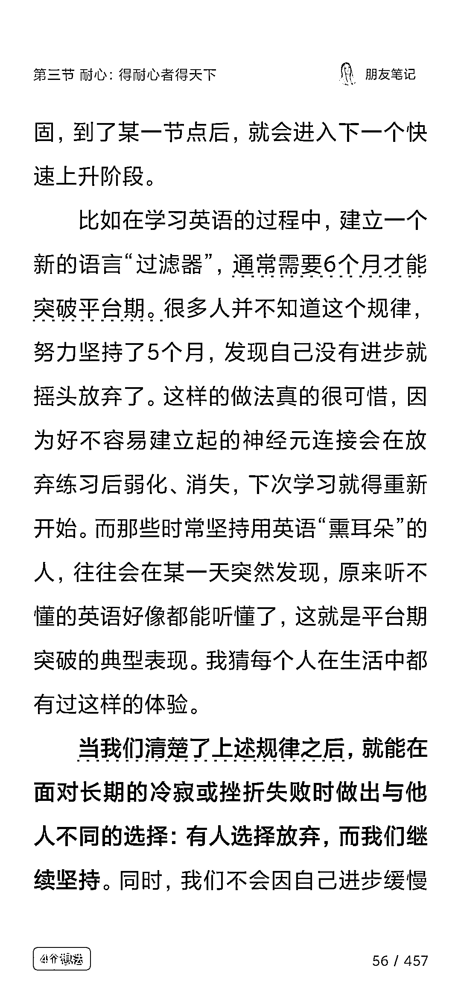
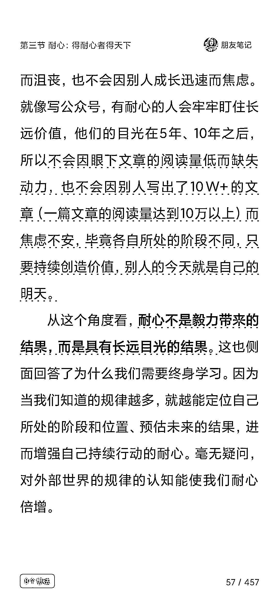
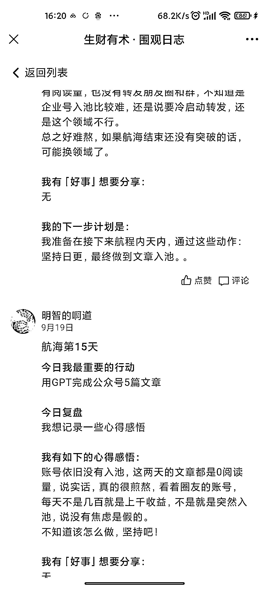
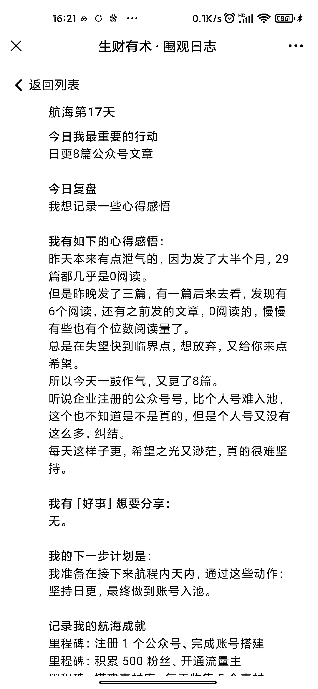
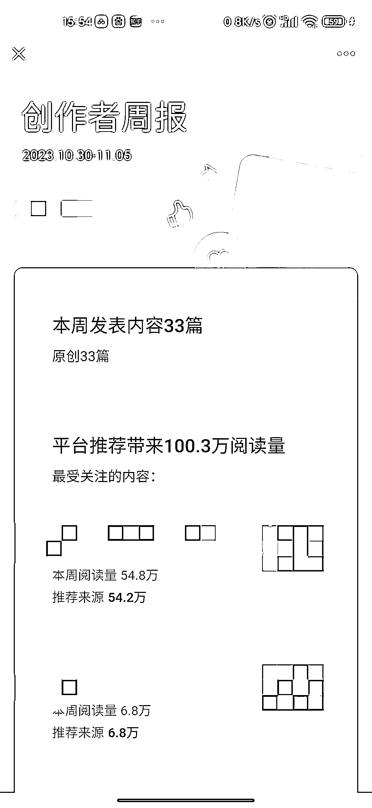

# 坚持与耐心，公众号的转折与突破

> 原文：[`www.yuque.com/for_lazy/xkrm14/zw5tahh8chwhcomz`](https://www.yuque.com/for_lazy/xkrm14/zw5tahh8chwhcomz)

作者： 阿道

日期：2023-11-06

点赞数：**132**

* * *

正文：

早上在微信读书看《认知觉醒》，读到一段关于耐心和坚持的内容，非常有同感。
我这个公众号是一个月前做起来的，之前参加航海，坚持了十几天，都是 0 阅读，我一度在质疑是不是自己选的领域不行，是不是自己的内容不行，是不是自己的号有问题。
看到其他圈友都陆续出成绩，自己每天辛苦的更，到底有没有意义。 真的，从一开始报名的信心满满，坚持了十几条没有结果就想放弃，真的，短短十几条心态的变化很大。
还好，就在我差点放弃的时候，来了转折，赶在航海结束前入池了，从几毛钱，到几十块，到一两百块。 然后一直不断破纪录，一周 100 万阅读，一天一号 800 多块。
而且我相信，还会在破纪录。 坚持下去，只要熬过那段最艰难的时候，在坚持一下，就会迎来一断柳暗花明。

* * *

评论区：

大魔王 : 每天都在积攒进步的力量，超棒哒

熊孩子不差！ : 加油

阿道 : 谢谢教练

阿道 : [玫瑰]

邓小寻 : 我现在就在经历 0 阅读量的状态[闭嘴]太崩溃了 没人看

阿道 : 搜一下，荷花定律，竹子定律，金蝉定律

松溪 : 我也在经历没人看的阶段[流泪]，接下来重新学习手册，坚持更新[奋斗]加油💪，向优秀的人看齐

能量菌 : 加油💪

* * *

