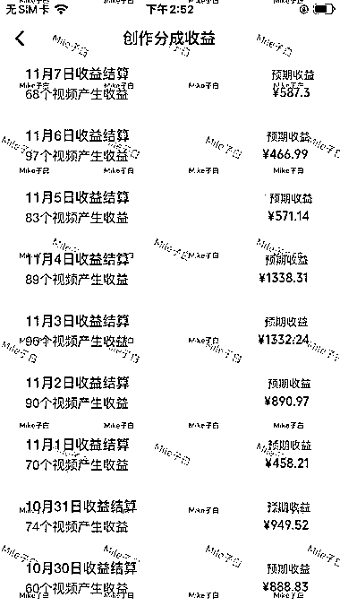

# 视频号分成计划：卡片广告点击是收益关键

> 原文：[`www.yuque.com/for_lazy/xkrm14/ttmcep3z1i6l2wzs`](https://www.yuque.com/for_lazy/xkrm14/ttmcep3z1i6l2wzs)

作者： 子白

日期：2023-11-08

点赞数：**94**

* * *

正文：

视频号分成计划，叫流量主也行。 收益来源于卡片广告的点击。只要有人在你的内容评论区点了这个广告，就有钱拿，光播放量没用，必须点击广告。
所以影响收益的因素有：评论、人群、广告类型。选赛道是核心科技，同样 100W 播放，不同的赛道收益相差 5 倍不止。

* * *

评论区：

酱油 : 大佬推荐几个赛道[流泪]

刘皇叔 : 道理是这么个道理，但是我实操下来，发现很多视频几万播放、几十条评论，收益却是 0，是什么情况呢？

大梁 : 68 个视频收益 500?搬运吗

子白 : 不搬运

能量菌 : 需要点击广告

stoneLee : 高质量内容，现在还没过[撇嘴]

子白 : 自己拍拍小吃摊，开车拍拍路况。除了风景不行，其他开原创不难的。

* * *

