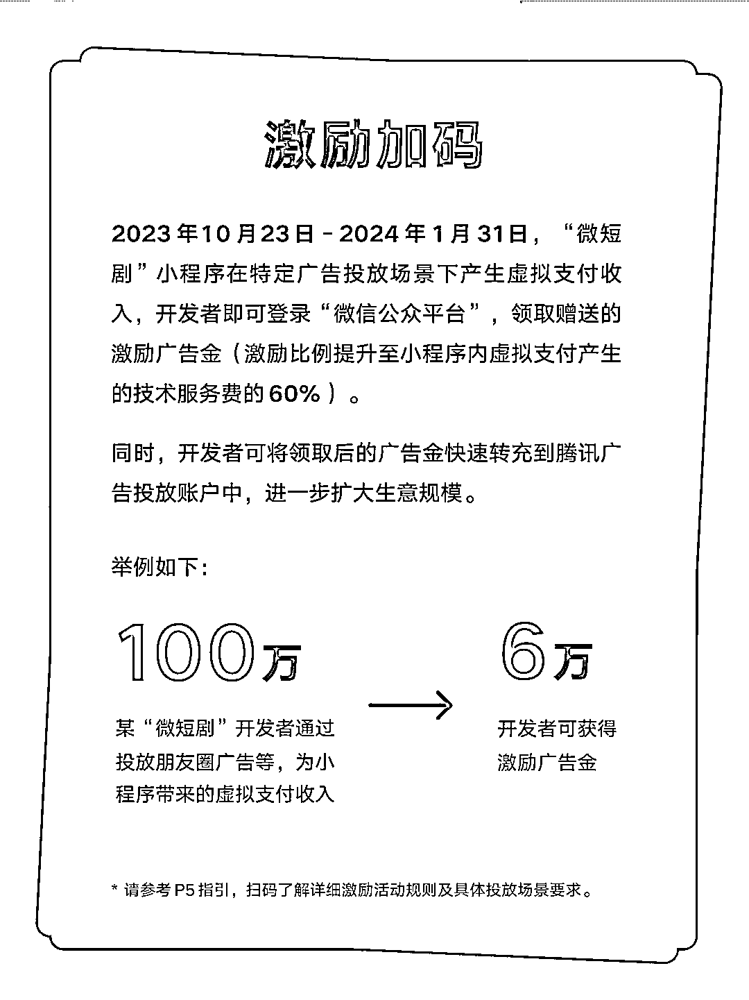
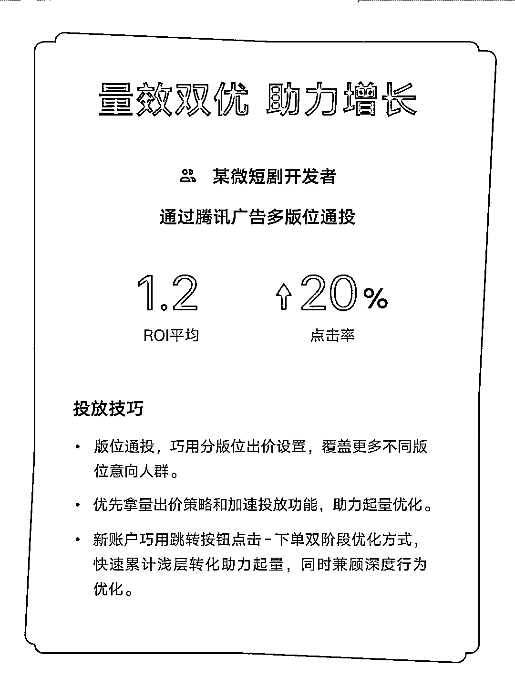

# 微信推出激励活动，开发者通过微短剧小程序赚取虚拟支付收入

> 原文：[`www.yuque.com/for_lazy/xkrm14/pwotgfudkgmd81vi`](https://www.yuque.com/for_lazy/xkrm14/pwotgfudkgmd81vi)

作者： 北辰

日期：2023-11-07

点赞数：**77**

* * *

正文：

微信·微短剧激励活动来了 🕓 2023 年 10 月 23 日 -
2024 年 1 月 31 日，“微短剧”小程序在特定广告投放场景下产生虚拟支付收入，开发者即可登录“微信公众平台”，领取赠送的激励广告金（激励比例提升至小程序内虚拟支付产生的技术服务费的
60%）。同时，开发者可将领取后的广告金快速转充到腾讯广告投放账户中，进一步扩大生意规模。

* * *

评论区：

蓝弈 : 打卡：这条风向标信息是最完整的[呲牙]

远帆 : 你是真快啊~

冬日暖阳 : 这个怎么做的呢

* * *

