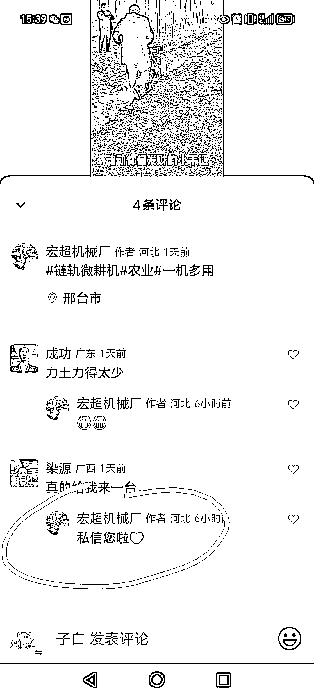
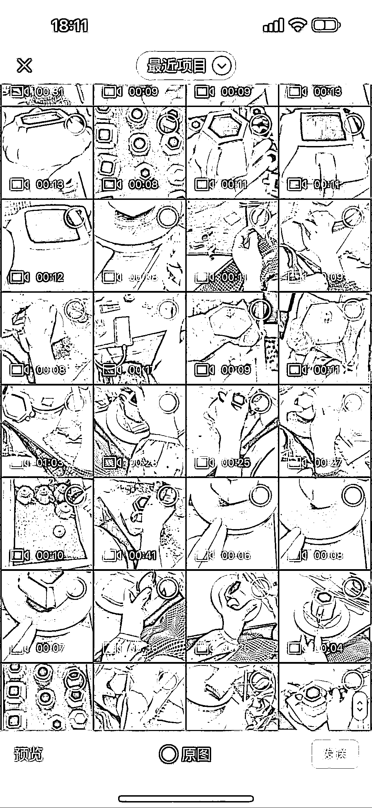

# 视频号助力实体厂家，选品标准和发展策略揭秘

> 原文：[`www.yuque.com/for_lazy/xkrm14/dr1m7ktdglu0cz9q`](https://www.yuque.com/for_lazy/xkrm14/dr1m7ktdglu0cz9q)

作者： 子白

日期：2023-11-09

点赞数：**93**

* * *

正文：

视频号助力实体厂家，不仅是豆浆机，可以带的品非常多。 选品标准大概是： 1、好展示，方便拍素材 2、客单价高一点 3、白牌 4、邮费不能太贵
5、厂家必须靠谱 比如微农机，微耕机，水泵之类，又比如紫砂壶什么的。
选品和最小测试搞定以后，这个账号就基本成熟了，可以交给员工做，一个员工全职能做 3-5 个号。
或者外包，把拍素材、剪辑配音、转私域成交等工作交给别人，你去测下一个品。

* * *

评论区：

哓 海丶 : 这种决策成本高，问的多，成交少

* * *

