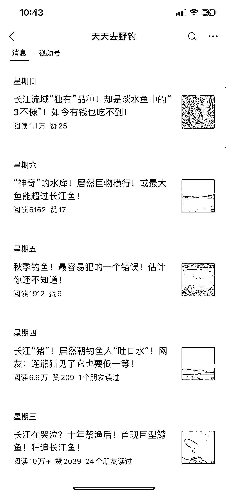

# 起号不到一个月，钓鱼类公众号创下十万+阅读量

> 原文：[`www.yuque.com/for_lazy/xkrm14/xcgba6kgp6sbarl5`](https://www.yuque.com/for_lazy/xkrm14/xcgba6kgp6sbarl5)

作者： 林元陸

日期：2023-11-07

点赞数：**69**

* * *

正文：

钓鱼类公众号，起号不到一个月就出现“十万+” 10 月 13 日才开通的公众号，目前已出现了阅读量分别是 10 万+、1.1 万、3 万的 3 篇爆款。
爆款文章主要分享作者自己的钓鱼经验，文中的插图都是作者自己在钓鱼、旅游、生活中拍摄的。真实度很高。
建议那些想要通过公众号流量主赚钱的圈友，也可以考虑一下深耕一两个自己感兴趣的、擅长的、垂直度较高的细分领域，通过输出兼具真实度与实用性的 UGC，触达更多精准客群，即使靠流量主收益分成，也可以沉淀一些精准粉丝到自己的私域。

* * *

评论区：

BLUE : 🎣和榴莲一样，很垂

Cobb : 感觉还行 不过冲量估计不够高

Cobb : 微信指数里面 大部分都是 视频 钓鱼相关内容

林元陸 : 谢谢启发

* * *

