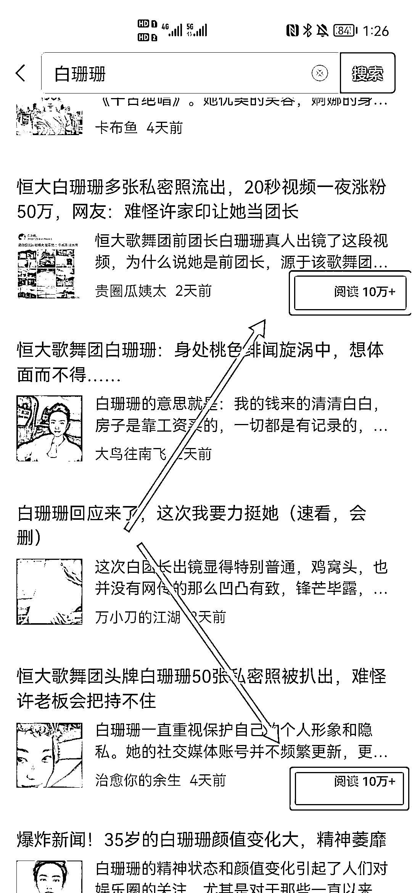
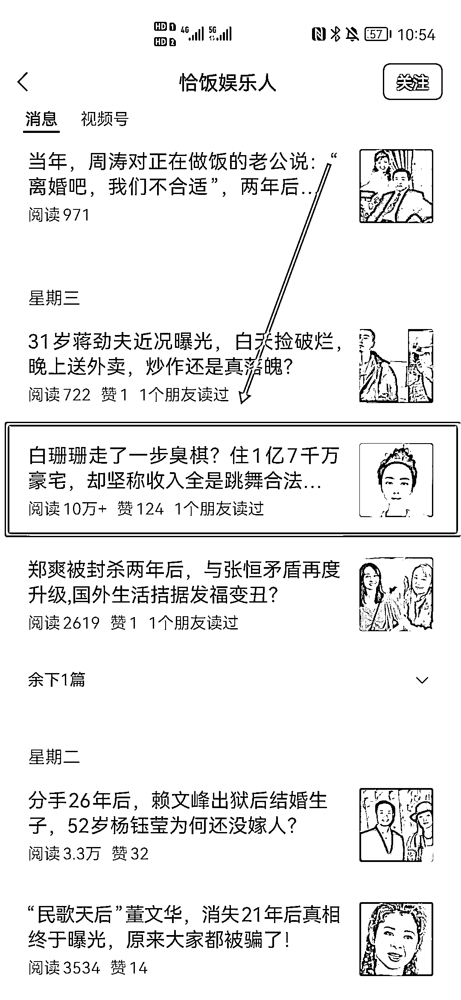

# 通过桃色绯闻，公众号推文阅读量突破 10w+

> 原文：[`www.yuque.com/for_lazy/xkrm14/yqcoaxsdi0rq85ke`](https://www.yuque.com/for_lazy/xkrm14/yqcoaxsdi0rq85ke)

作者： 希平

日期：2023-11-06

点赞数：**47**

* * *

正文：

通过桃色绯闻，公众号推文阅读量获取 10w+
最近微信搜索许，就会发现好多关键词（图 1），最热的有两个，一个是许跟恒大有关的企业问题（图 2），一个是许与白有关的桃色绯闻（图 3）
其中有个公众号，叫做常哥课堂的，每天公众号推文必有许的文章，阅读量篇篇过万（图 4 图 5）。
有个公众号，叫做恰饭娱乐人，通过一篇许跟白的绯闻，阅读量突破 10w（图 6）
需求分析：每个人在 20～30 岁都会有奋斗经历，这时候会额外关注成功人士，一个是同龄人，比如我们关注的许华升、小杨哥，一个是年长 20 岁的人，比如我们关注的马化腾、马云……
经过了 20 年的洗礼，曾经的年轻人也变成了中年人，也就是到了 50-70 岁，也就是这类公众号的读者，那么他们很熟悉以前同龄人钟睒睒、许家印、黄光裕，年长者褚时健、宗庆后等名人。
而人天生喜欢八卦，读者退休很闲，而名人难免会带点桃色绯闻，这时候针对读者早已熟知的名人，创作者能获得很好的流量。

* * *

评论区：

能量菌 : 这些人也是捕风捉影，甚至自编自演

土豆先生 : 这种擦边炸号玩法，号多的才能玩。而且编撰造谣的是有风险的。

希平 : 造谣就没必要，你可以引用别人的消息源，比如说据 xx 说，这样子别人委托律师找上门也能有理有据，但刻意或屡教不改，就会出现问题

希平 : 为了流量

* * *

