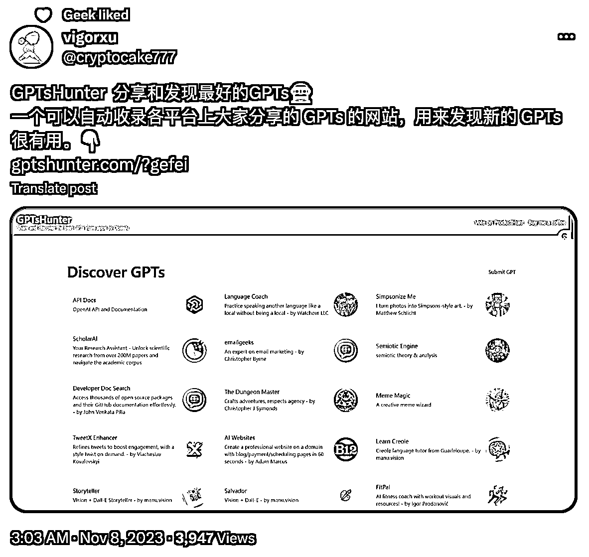

# AI 时代的网站流量获取方法：抓住热点，快速上线，简单实现

> 原文：[`www.yuque.com/for_lazy/xkrm14/ek6vsg2u0h11161l`](https://www.yuque.com/for_lazy/xkrm14/ek6vsg2u0h11161l)

作者： 哥飞

日期：2023-11-08

点赞数：**64**

* * *

正文：

AI 时代做网站快速获取流量的方法很简单，今天上线的这个网站 ，到现在 13 个小时，UV 快 4000 了，因为是单页网站，所以 PV 五千多。 怎么做到的？
热，GPTs 目前是热点。 快，比别人更快上线。 简，直接用 html+css+json 生成静态页面，简化开发。
热点，所以大家好奇心强，自带传播性，能够让很多人帮忙传播。 快速，用 ChatGPT 辅助开发代码，选择最简单的 html+css+json
生成纯静态网站，不用纠结选择什么框架。 抓住热点，快速制作网站，快速上线，获取流量，你也可以。[Custom GPTs and the GPT Store
by OpenAI | GPTsHunt...](https://GPTsHunter.com/?gefei)

* * *

评论区：

木桶伯 : 流量数据在哪里看的？

哥飞 : 站长是我朋友，他给我的截图

* * *

公众号懒人找资源，懒人专属群分享