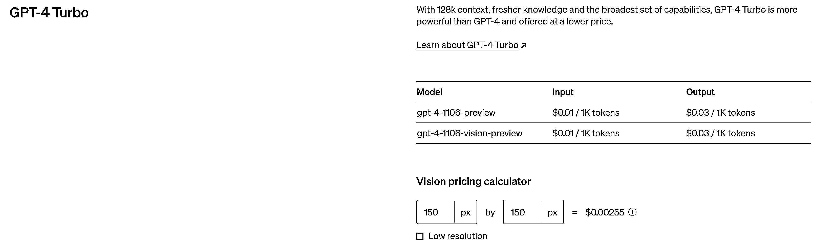

# ChatGPT-4 Turbo 发布：价格更优惠，知识更新至 2023 年

> 原文：[`www.yuque.com/for_lazy/xkrm14/aemu3aqvgq994fv1`](https://www.yuque.com/for_lazy/xkrm14/aemu3aqvgq994fv1)

作者： Zero

日期：2023-11-07

点赞数：**42**

* * *

正文：

刚刚看完 gpt 开发者大会，然后让 gpt 总结了一下。 GPT-4
Turbo：这是 GPT-4 的改进版本，提供了两种模式：仅文本分析和同时理解文本与图像的版本。该模型的文本分析版本预览 API 现已上线，并计划在未来几周内推出完整版本。GPT-4
Turbo 的输入令牌价格为每千个 0.01 美元（约合 750 字），输出令牌为每千个 0.03 美元。例如，向 GPT-4
Turbo 传递 1080×1080 像素的图像将花费 0.00765 美元​1。 价格优势：GPT-4
Turbo 的输入令牌价格是 GPT-4 的三分之一，输出令牌价格是 GPT-4 的二分之一​1​。
知识更新：GPT-4 基于截至 2021 年 9 月的网络数据进行训练，而 GPT-4 Turbo 的知识截止日期为 2023 年 4 月，这将提供关于近期事件更准确的答案​。
上下文窗口：GPT-4
Turbo 提供了一个 128,000 令牌的上下文窗口，是 GPT-4 的四倍，也是目前商业模型中最大的上下文窗口，相当于约 10 万字或 300 页的文本量​。
JSON 模式：GPT-4 Turbo 支持新的 JSON 模式，确保模型返回有效的 JSON 格式数据，这在需要传输数据的 Web 应用程序中非常有用​。
微调程序：OpenAI 推出了针对 GPT-4 的实验性微调程序，与 GPT-3.5 的微调程序相比，GPT-4 的程序将涉及 OpenAI 团队更多的监督和指导​。
除此之外，还有一些泄露的功能更新： ChatGPT 原型 Gizmo
V8：提供了一系列新功能，包括一个 Sandbox 环境用于导入、测试和增强现有聊天机器人，以及用于定义额外机器人能力的自定义操作等​。 Context
Connectors：这是一个新功能，将允许 ChatGPT 连接外部应用程序，如 Microsoft 365 和 Google
Drive，通过函数调用机制访问特定的 API​​。 GPT
Builder：这是一个新的工具，允许用户个性化并分发他们的 AI 助手或者完全定制新的 GPT。此外，GPT Builder 还利用 DALL-E
3 为这些 GPT 生成头像，并允许用户直接在应用程序中嵌入函数，并引入自定义操作​​。

* * *

评论区：

* * *

公众号懒人找资源，懒人专属群分享