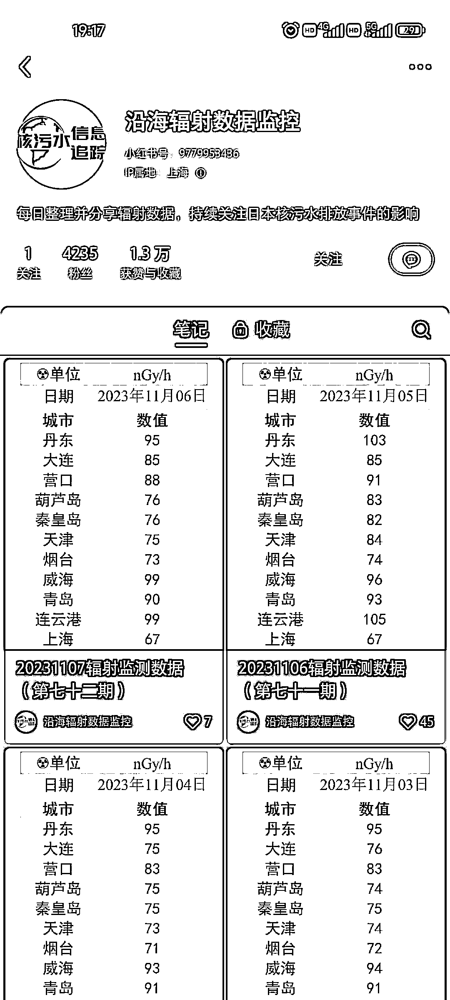

# 持续关注日本核污水排海事件，视频评论区热度居高

> 原文：[`www.yuque.com/for_lazy/xkrm14/gqh7qznycvcq72ah`](https://www.yuque.com/for_lazy/xkrm14/gqh7qznycvcq72ah)

作者： 辛禾

日期：2023-11-07

点赞数：**77**

* * *

正文：

从 8·24 日本开始核污水排海，到现在持续在更新相关最新消息和各地辐射数据，每天依然有许多人关注，且视频评论区评论量居高，符合人性且贵在坚持，终有收获

* * *

评论区：

* * *

