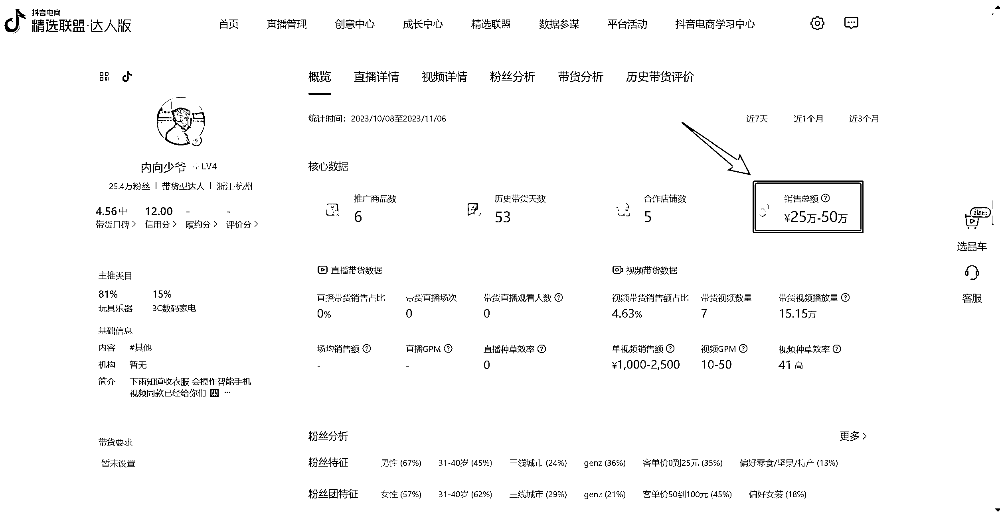
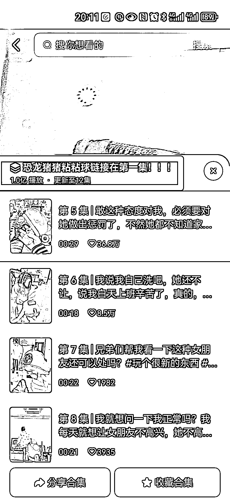
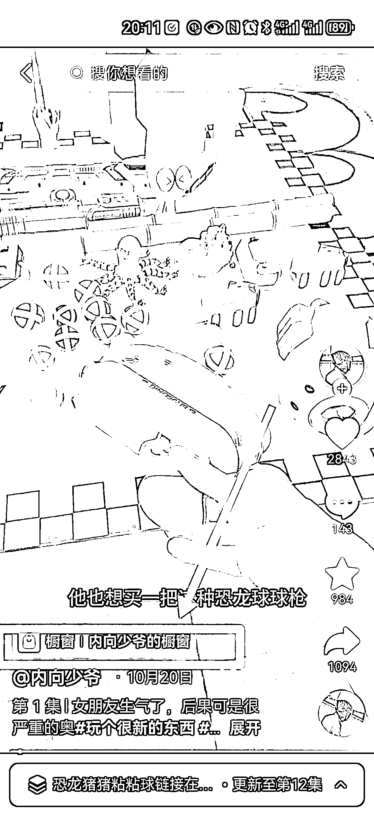

# 恐龙猪猪粘粘球带货账号月销售额 20w+，创新引流方式提高转化率

> 原文：[`www.yuque.com/for_lazy/xkrm14/ke07xgryznusf88w`](https://www.yuque.com/for_lazy/xkrm14/ke07xgryznusf88w)

作者： 希平

日期：2023-11-07

点赞数：**75**

* * *

正文：

卖恐龙猪猪粘粘球，单月销售额 20w+ 刚刚刷到一个抖音账号，叫做内向少爷，粉丝数 25w（图 1），卖的是恐龙萌猪弹射粘粘球、
充电萝卜点火器等儿童玩具，单月销售额 25w-50w（图 2），大头在恐龙萌猪弹射粘粘球（图 3）。
流量：视频拍摄很简单，就是自己用手枪发射，不断将粘粘球发射到女朋友身上，最终女朋友生气，自己被惩罚，有种自作自受的味道，但评论区很多男女都在评论区吐槽自己的另一半贱贱的事情。
产品：主要卖恐龙萌猪弹射粘粘球，单月销售额 20w+，按照佣金 10%~15%，起码赚了 2w
转化：博主在视频带货有个创新点，那就是创建了一个合集，名称为「恐龙萌猪弹射粘粘球在第一集」（图 4），在第一集视频左下角放上了商品橱窗链接（图 5），而合集的其他集视频，都没有放上橱窗，而是通过底部合计的名称，引导用户去第一集视频去购买（图 6）。
好处：带货视频看重付费转化率，而内容视频看重评论点赞等互动数据，这个博主的转化创新点，首先通过内容视频去获取流量，然后通过合集名称做付费引导，最终在带货视频的橱窗做成交。
这样子的好处： 1.既提高了带货视频的付费转化率（大部分单子都在这个视频的橱窗下的），抖音官方不断给新流量；
2.又让内容视频不断去获取流量（内容视频不碰橱窗，不需要背负付费转化率的指标），抖音官方不断给新流量。

* * *

评论区：

能量菌 : 有意思

* * *

公众号懒人找资源，懒人专属群分享