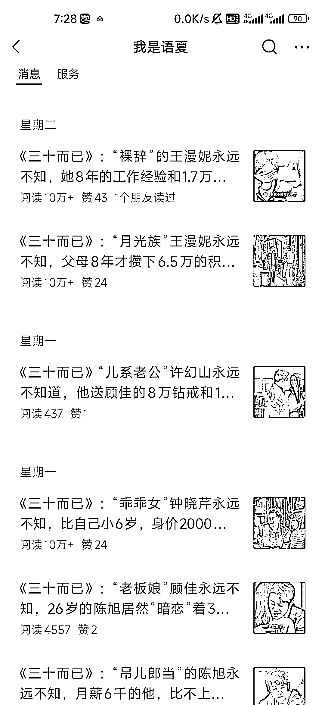
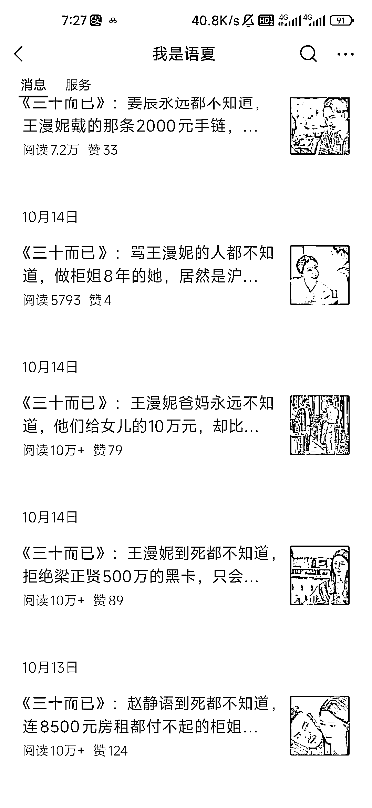

# 垂直赛道的流量主，关注这篇风向标文章

> 原文：[`www.yuque.com/for_lazy/xkrm14/elf3xifqoof4qzne`](https://www.yuque.com/for_lazy/xkrm14/elf3xifqoof4qzne)

作者： 马小威

日期：2023-11-09

点赞数：**97**

* * *

正文：

9.25 开始写的三十而已 写出了几十篇十万+ 流量主也可以考虑一下非常垂直的赛道

* * *

评论区：

人好话不多 : 跟之前有个朋友说，一直狂怼甄嬛这种大剧 ip 一样，确实好多人看。 加上感觉三十有关键字加成

能量菌 : 这个不错

朝暮拾花 : 马上跟

xinz : 难怪最近这么多三十而已的文章，原来是圈友干的

* * *

公众号懒人找资源，懒人专属群分享